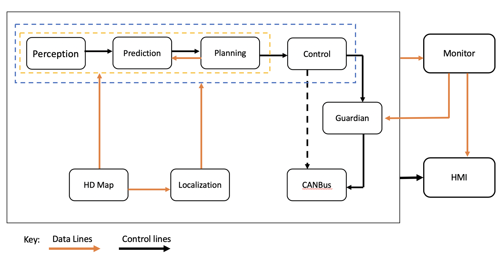

# The Conceptual Architecture of Apollo

(content to be added)

## Abstract

Apollo is an open-source autonomous driving platform supporting the development of systems for self-driving vehicles. Such a system must carefully develop its architecture to fulfil the requirements of stakeholders such as investors, developers and users.  

To extract the software system’s conceptual architecture, we considered a reference architecture created by Sagar Behere and Martin Törngren, as well as Apollo’s documentation, notably that found on their current version (7.0) and version 5.5 GitHub pages. This documentation reveals an architecture containing various components mapping to the reference architecture. Apollo’s architecture largely relies on a publish-subscribe style that allows for high concurrency and performance, as well as simplified system evolution.  

## Introduction

### Software System

Apollo is an autonomous driving platform specializing in supporting the development of self-driving vehicles. Initially announced in 2017, the project has since developed from being able to follow GPS Waypoints towards fully “driverless driving;” as of December 2021, Apollo has reached version 7.0. The system is open-source and documented in detail. [\[GitHub\]](https://github.com/ApolloAuto/apollo)  

Apollo’s Open Software Platform needs a complex system to fulfil the requirements of an autonomously driving vehicle. In particular, the system needs to be able to determine its surroundings and situation, predict how these may change, and plan how the vehicle will move accordingly, ultimately determining the vehicle’s trajectory. These functions must perform efficiently and accurately for the system to run as expected in real-life scenarios that vehicles and their drivers experience.  

This report studies and describes the conceptual architecture used within the system.  

### Derivation Process
Deriving the architecture presented involved reading academic papers as well as the Apollo documentation, including that from previous versions, such as 5.5.  

Sagar Behere and Martin Törngren have formed a functional reference architecture for autonomous driving platforms up to level L4 of autonomy [\[Behere and Törngren 138\]](https://www.sciencedirect.com/science/article/abs/pii/S0950584915002177). As they discuss, this form of architecture is the starting point for architectural design of a system and may aid in other implementations in the field of focus, in this case, self-driving vehicles. Their reference architecture is depicted in Figure 1; it includes a variety of modules and components relating to the functionality of the vehicle.  

<figure>
    
    <figcaption><b>Figure 1:</b> A functional reference architecture for an autonomous driving platform, as provided by Behere and Törngren. [ibid., 143]</figcaption>
</figure>

Components relating to the system’s perception include sensors; a “sensor fusion” that forms an idea regarding the environment; a localization component relating to the location of the vehicle; a “semantic understanding” component; and a “world model” component that describes the external world of the vehicle. These components connect, as shown in detail in Figure 1, to perceive and understand the environment that the vehicle is in. [ibid., 139-140]  

The decision and control component works to understand the vehicle’s various characteristics, including trajectories it can travel (as well as the “optimal” one) and its energy (electricity, gas, hybrid, etc.). By understanding these characteristics, this component may make the appropriate decisions, hence controlling what the system does. [ibid., 140-141]  

The vehicle platform itself refers to the internal system, including the execution of trajectories, managing the energy that is noted in the energy sub-component of decision and control, and managing the safety and control of the vehicle, including regularly considering the state of the system via the diagnostics and faults management systems. [ibid., 141]  

## Requirements

We initially identified three main categories of stakeholders and their high-level needs based on their type of interaction with the system. Starting at the production end is any stakeholder involved with the design, manufacturing, and selling of the system; this might include engineers, developers, producers, and investors. Their needs are focused on modularity and adaptability; reducing complexity and use of existing resources can lead to faster prototyping and lower costs. The second category are the users who purchase or otherwise own and depend primarily on the functionality of the system. Their needs are convenience (usability, affordability, etc.) and effectiveness. The remaining group of stakeholders is the technical support, whose needs involve diagnostics and modifications.  

Apollo is a complex platform that has been built over time based on specific driving cases. [\[GitHub\]](https://github.com/ApolloAuto/apollo/blob/master/docs/technical_documents/open_space_decider.md) Understanding the requirements of such a system is integral to its development, particularly as vehicles are an aspect of urban life where safety is essential. For this, any driver must be aware of their surroundings and react accordingly. Thus an autonomous system that imitates a driving experience requires excellent performance—it must be able to react in short periods of time while at the same time driving as accurately as a user (and any person on the road) expects. Being on the road brings a variety of complex situations that must be considered for the system while maintaining good performance.  

Apollo is a system that connects to the cloud for security purposes, as well as calibration [\[Baidu\]](https://apollo.auto/platform/perception.html); the system’s security is important to the safety of those on the road. Apollo offers various products relating to security for its system. IDPS takes note of errors as soon as possible and reports them to the cloud, also preventing them from affecting the entire system. Secure IVI considers applications and prevents unauthorized access by suspicious apps. [\[Baidu\]](https://apollo.auto/platform/security.html) Authorization is integral to the system, protecting from any potential attackers; encryption may also deter them. Thus, a system such as Apollo must take security seriously.  

Any autonomous system needs to be reliable, as a user would expect the system to be able to mostly drive on its own and make decisions as appropriate in short periods of time. Such a system must be continuously available. Security systems notice errors within the system and react accordingly, so the system should be as available as possible to ensure errors are noticed; the system being unavailable may also negatively impact safety.
Apollo also highlights the importance of its use by other developers interested in the platform, including the implementation of an online development platform dedicated to this development. [\[GitHub\]](https://github.com/ApolloAuto/apollo/releases) Modifiability, then, would be an important non-functional requirement for the system to ease these developers in their process.  

The development process of Apollo from 1.0 to 7.0 has been documented in detail, with summaries on their GitHub release page; a variety of requirements for the system may be extracted from the release summaries alone. These functional requirements include but are not limited to: (1) driving by following GPS signals; (2) cruising, not only in lanes but also in urban roads and on highways; (3) avoiding collisions with other vehicles, objects, pedestrians, etc.; (4) changing lanes as appropriate; (5) stopping at traffic lights; (6) safely turning at intersections; and (7) parking with the appropriate method.  

## Conceptual Architecture

### Overview

<figure>
    
    <figcaption><b>Figure 2:</b> Apollo 3.5 software architecture core modules interaction diagram, from the project documentation on GitHub. <a href="https://github.com/ApolloAuto/apollo/blob/master/docs/demo_guide/images/Apollo_3_5_software_architecture.png">[GitHub]</a></figcaption>
</figure>

Figure 2 represents the software architecture of Apollo as of version 3.5. As a top-level view of the architecture, it does not describe the system as closely as the functional reference architecture created by Behere and Törngren; however, both architectures feature similar key components, including perception, localization, and control. The planning component in the Apollo architecture may also coincide with the decision and control component of the reference architecture.  

<figure>
    
    <figcaption><b>Figure 3:</b> Description of various aspects of the Apollo 7.0 platform, as highlighted in the project documentation on GitHub.  <a href="https://github.com/ApolloAuto/apollo/blob/master/docs/demo_guide/images/Apollo_7_0.png">[GitHub]</a></figcaption>
</figure>

Figure 3 displays key components in the Apollo platforms; the Open Software Platform section of the figure includes some similar components as in the architecture but includes a V2X adapter and Apollo Cyber RT (described below), all running on a real-time operating system (RTOS), as well as a map engine relating to the HD map within the architecture (that is instead shown within the Cloud Service Platform).  

The Apollo software architecture documentation only extends up to version 5.5, but while it has not been updated for releases 6.0 and 7.0, those have primarily added new deep learning models and developer frontends and have not significantly changed the overall architecture.  

Studying Apollo’s documentation reveals that the software platform consists of thirteen major subsystems: twelve providing autonomous vehicle functionality, and one providing a communication and runtime framework for the operation of the others. This central runtime is known as Apollo Cyber RT and is described in further detail below.  

<figure>
    
    <figcaption><b>Figure 4:</b> The dependency relations of Apollo’s software modules, derived from descriptions in the project documentation.</figcaption>
</figure>

<figure>
    
    <figcaption><b>Figure 5:</b> The communication flow between the core Apollo modules.</figcaption>
</figure>

Using Apollo project documentation, the names and functionality of the major modules of the software platform were identified and their interactions diagrammed as dependency relations in Figure 4. These interactions end up being quite complex. However, the Cyber RT framework provides the communication facilities for the modules to interact, primarily in a publish-subscribe pattern. This allows the system overall to remain largely decoupled, as shown in Figure 5.  

### Subsystems

Apollo contains thirteen major modules or subsystems within it: Cyber RT, Perception, Prediction, Planning, Storytelling, Routing, HD Map, Monitor, Dreamview, Guardian, Localization, Control, and CanBus. [\[GitHub\]](https://github.com/ApolloAuto/apollo/blob/master/docs/specs/Apollo_5.5_Software_Architecture.md) The following subsections describe these modules and explore how they relate to Behere and Törngren’s reference architecture in Figure 1.  

#### Cyber RT

The central subsystem of Apollo’s architecture is a custom runtime framework known as **Cyber RT**. This runtime system is responsible for loading and launching the other major components and providing a mechanism for them to communicate with one another. The developers of Apollo describe this component as high concurrency and throughput that allows for high performance; it is specialized for autonomous driving. [\[GitHub\]](https://github.com/ApolloAuto/apollo/blob/master/cyber/README.md) Using channels (or topics) of Cyber RT, modules communicate in a publish-subscribe manner, allowing for flexibility and decoupling of modules; they may also communicate in a client/server method through this component. [\[GitHub\]](https://github.com/ApolloAuto/apollo/blob/master/docs/cyber/CyberRT_Terms.md)  

#### Perception

The **Perception** subsystem is a low-level component which takes input directly from physical sensors mounted on a vehicle. These sensors include two forward-facing cameras, four LiDAR sensors with each facing a different direction as well as forward- and rear-facing radar. Stereo images provided by the cameras and LiDAR data are fed to a deep learning model which labels objects in the field of view. Objects are also tracked through each of the sensor systems (camera, radar, LiDAR) and the results amalgamated by the “sensor fusion” module. Ultimately this subsystem outputs decisions on the state of nearby traffic lights and a list of objects which are labelled with their type, distance away and velocity. [\[GitHub\]](https://github.com/ApolloAuto/apollo/blob/master/modules/perception/README.md)  

The perception subsystem of Apollo overlaps with some functions of the External Sensing, Sensor Fusion, Semantic Understanding and External World Model subsystems of the reference architecture.  

#### Prediction

The **Prediction** subsystem predicts the future movements of objects identified by the perception module. This subsystem takes input from the perception component as well as the localization and planning subsystems. Internal architecture of this system is structured sequentially. The “scenario” submodule characterizes the situation as either cruise, for simple driving in lane, or junction, for driving in an intersection. Then, obstacles are given a priority label which is either “caution”, “ignore”, or “normal”. The "evaluator” submodule independently predicts a path and a speed for each obstacle and marks the path with a probability. Finally, a “predictor” submodule produces an expected trajectory for each obstacle. [\[GitHub\]](https://github.com/ApolloAuto/apollo/tree/master/modules/prediction)  

The prediction subsystem of Apollo performs tasks that are under the Semantic Understanding and External World Model subsystems of the reference architecture.  

#### Planning

The **Planning** subsystem is a high-level component that aims to plan the exact route of the vehicle. This subsystem receives data from the Prediction and HD map components to plan short term goals, such as waiting at a traffic light, avoiding a collision, or staying in a lane. Then the planning module receives route data from the Routing module and plans the future trajectory of the vehicle through high-level maneuvers such as executing a three-point turn. In the case where the vehicle is unable to follow the route prescribed by the Routing module, the Planning module may request a new routing computation. [\[GitHub\]](https://github.com/ApolloAuto/apollo/blob/master/modules/planning/README.md)  

The planning module of Apollo is roughly equivalent to the Trajectory system within the control module of the reference architecture.  

#### Storytelling

The **Storytelling** subsystem is a high-level scenario manager intended to coordinate inter-module actions. Complex driving scenarios require intensive communication between modules. To avoid a sequential architecture in these situations, the storytelling module creates “stories”; complex scenarios that trigger many other modules. These stories are published and can be subscribed to by any other module. [\[GitHub\]](https://github.com/ApolloAuto/apollo/blob/master/modules/storytelling/README.md)  

The Storytelling subsystem is specific to the implementation of Apollo and does not have a mapping to the reference architecture.  

#### Routing

The **Routing** subsystem generates navigation paths given a target start and end point, using the topology of the terrain. Typically, the end point is the destination of the passenger, and the start point is the current location of the vehicle. This subsystem does high-level navigation using map data and could be compared to a GPS installed in most cars today. A routing map is outputted and used for the lower-level navigation done by Planning. [\[GitHub\]](https://github.com/ApolloAuto/apollo/blob/master/modules/routing/README.md)  

The Routing component of Apollo could be part of the trajectory component of the reference architecture. However, it is unclear whether the reference architecture treats navigation as a Trajectory task, a Localization task or a cloud server task.  

#### HD Map

The **HD Map** functions as a query engine for the other modules to provide on demand, high granularity information about the roads. It retrieves map data from the cloud upon request and caches map data for repeated reuse. The information from the HD Map is queried by the routing module to plan high level routes. [\[GitHub\]](https://github.com/ApolloAuto/apollo/blob/master/docs/specs/Apollo_5.5_Software_Architecture.md)  

Apollo’s HD Map has both an onboard client component as well as an offboard server component. There are two possible interpretations of the reference architecture documentation as it pertains to navigation. One possibility is that all map data is stored onboard in the Localization module. Another is that map and routing functions are performed off the vehicle platform. The maps are then remotely sent to the vehicle to contribute to the vehicle’s External World Model.  

#### Monitor

The **Monitor** module provides status checks of both hardware and software components of the system. This subsystem surveils all the modules of the vehicle, as well as hardware to ensure they are working as intended. This data is passed to the Dreamview for the passenger to easily view the status of the system. [\[GitHub\]](https://github.com/ApolloAuto/apollo/blob/master/modules/monitor/README.md)  

The Monitor component of Apollo has a similar function to Platform Fault Management in the reference architecture.  

#### Dreamview

**Dreamview**, Apollo’s **HMI** module, provides a UI in the form of a web application that allows developers or vehicle passengers to visualize the data produced by other subsystems. Given the inputs of the other modules, Dreamview produces a three-dimensional representation of the vehicle including the current location and planned path. Additionally, using data from the Monitor module, Dreamview displays the status of the components and hardware of the vehicle. [\[GitHub\]](https://github.com/ApolloAuto/apollo/blob/master/modules/dreamview/README.md)  

Apollo’s Dreamview visualization interface is an example of a service that is performed offboard in the reference architecture, in this case both tele-operation and remote monitoring.  

#### Guardian

The **Guardian** module serves as an “action center” that will only react in case of module failure. Using reports sent by the Monitor, the Guardian may do one of two things. If all modules are working as expected, the Guardian allows the process to continue normally. If the Monitor detects failure of some form, the Guardian works to handle the failure by preventing controls from reaching the CanBus, then stopping the vehicle. The Guardian manages two main types of shutdowns. If the sensors are operating normally and do not detect any obstacles the vehicle will enter a controlled slow stop by applying light breaking. In the second scenario, if the sensors are not operating normally, the Guardian applies heavy breaking to bring the car to an immediate stop. [\[GitHub\]](https://github.com/ApolloAuto/apollo/blob/master/docs/specs/Apollo_5.5_Software_Architecture.md#guardian)  

Apollo’s Guardian module works with the Monitor module to produce the functions of Platform Management in the reference architecture.  

#### Localization

The **Localization** component is a low-level module that provides localization services to other components. Depending on the hardware available in the car, this module can use a combination of GPS, an inertial measurement unit, and LiDAR. The localization component outputs an estimate of the vehicle's location. [\[GitHub\]](https://github.com/ApolloAuto/apollo/blob/master/modules/localization/README.md)  

Apollo’s Localization module is equivalent to the Localization module in the reference architecture.  

#### Control

The **Control** component generates control commands for the vehicle to create a “comfortable driving experience.” Using the localization of the vehicle, the car status, and the trajectory created by the Planning module, commands are created by various algorithms depending on the scenario. Commands include those for the steering, brakes, and throttle, to be used by the chassis. These commands are passed to the CanBus to control the vehicle hardware. [\[GitHub\]](https://github.com/ApolloAuto/apollo/blob/master/modules/control/README.md)  

Apollo’s Control module is comparable to the Control module in the reference architecture. However, the reference architecture considers several decision-making functions to be within the Control subsystem whereas Apollo’s Control module is separate from its Planning and Guardian, for example.  

#### CanBus

**CanBus** works closely with the Control module, acting as the interface between the software system and the physical vehicle chassis. In one direction, the module uses a suite of sensors specific to the vehicle model to report the status of the car to Control. In the other direction, it executes the actions required to actualize the commands sent from Control, such as changing direction, engaging brakes, and accelerating. [\[GitHub\]](https://github.com/ApolloAuto/apollo/blob/master/modules/canbus/README.md)  

The CanBus module onboard the Apollo software system is one implementation of the Vehicle Platform Abstraction component of the reference architecture.  

### Concurrency

The Cyber RT framework that underlies the other modules of the software platform provides several mechanisms for concurrency. At a high level, it implements a “task” abstraction to describe asynchronous computing operations. Beyond this, Cyber RT provides different resource scheduling algorithms that developers can choose from to better suit specific scenarios, as well as a coroutine implementation called “CRoutine” that optimizes system resource and thread utilization. [\[GitHub\]](https://github.com/ApolloAuto/apollo/blob/master/docs/cyber/CyberRT_Terms.md)  

### Architecture Styles

The primary architectural style present in the Apollo software platform is publish-subscribe, which allows the various subsystems to interact in a well-defined and loosely coupled manner. As discussed previously, the Apollo Cyber RT system acts as a message broker in this architecture. Cyber provides an implementation of “channels” as a mechanism of data communication between the other modules, which can act as either “readers” or “writers” in respect to a given channel. [\[GitHub\]](https://github.com/ApolloAuto/apollo/blob/master/docs/cyber/CyberRT_Terms.md) Acting as a writer, a module publishes messages to a channel, consisting of structured data such as commands, events, or sensor data. When acting as a reader, a module has defined interfaces that handle processing and reacting to messages on subscribed channels according to registered function callbacks. [\[GitHub\]](https://github.com/ApolloAuto/apollo/blob/master/docs/cyber/CyberRT_API_for_Developers.md) There does not seem to be any limit to how many channels a module can act as a reader or writer on, but each writer interface defines a unique channel to enforce isolation by message “topic”.  

There are many benefits to the publish-subscribe model in a system as complex as Apollo. By relying on broadcast events, modules can send out commands or data to other parts of the system without having to lose process control or wait for responses. This is crucial in the domain of autonomous driving as continuous operation of all subsystems is critical for the continuing operation and safety of the vehicle and its occupants. From a development standpoint, the architecture also allows for the various subsystem modules to be independent and isolated, only interacting by certain strict mechanisms and interfaces, and keeping them loosely coupled. It also simplifies future evolution of the system, since the strict interfaces and loose coupling make it easier for modules to be split, replaced, or even removed, and for new modules to be added.  

However, publish-subscribe is not the only communication mechanism present in the platform, and while it is prevalent enough to define the overall architecture there are certain components that interact according to other patterns. In addition to the publish-subscribe facilities, Cyber RT also provides interfaces for client-server-style interaction, for scenarios requiring two-way request-response communication. [\[GitHub\]](https://github.com/ApolloAuto/apollo/blob/master/docs/cyber/CyberRT_API_for_Developers.md) One case where this is used seems to be in making ad hoc queries to the HD Map module.  

Finally, it is worth noting that by using these mechanisms, the Control and CanBus subsystems implement a process control pattern. In this sense, the Control module acts as the controller, creating execution plans for car actions based on requirements and data from the other modules, while the CanBus acts as the process, interfacing with the actual physical vehicle to actualize the commands from Control as well as providing it with feedback from chassis sensors.  

## Use Cases

<figure>
    
    <figcaption><b>Figure UC0:</b> Sequence diagram of the ‘loop’ that the Apollo system goes through as it creates the optimal path for the vehicle to go. It is described in the text.</figcaption>
</figure>

Figure UC0 displays how the system logic works in a loop of sorts, in that this process continues to be performed while the vehicle is driven, and the appropriate modules are working.  

The Localization module must first estimate the location of the vehicle and publish it to Cyber RT, which brokers the data to all subscribed modules. Routing and Storytelling both use the localization data, as well as queried map data from HD Map, to generate a route and a story, respectively. These are published to and brokered by Cyber RT. After receiving data from the sensors, the Perception module then determines obstacles, lanes, and traffic light status (if applicable), which is again published to and brokered by Cyber RT. The Prediction module uses this Perception data, as well as Localization, Routing, and the previous trajectory of Planning, to predict obstacle trajectories and prioritize them. These are published to Cyber RT, then sent to the Planning module; given Localization, Perception, Prediction, Routing, and Storytelling, as well as queried map data, the optimal trajectory is created by Planning. It is published to Cyber RT, then brokered to Prediction and Control. The Control module then generates the appropriate control commands, which are published. If the system is in a good state, then the CanBus retrieves these controls, sending them to the hardware, and publishes chassis data.  

While these processes are running, the HMI retrieves data using Cyber RT’s channels, displaying them to the user or driver. The Monitor may also retrieve these data, processing them and publishing a report that details the state of the modules; Cyber RT then sends the report to both the HMI and Guardian. The HMI displays the report’s results, while the Guardian ensures that there are no issues. If there are any failures, however, then the Guardian will enact its procedure to handle it as described in [Subsystems](#subsystems).  

### Use case 1: Lane following

The first use case is the default lane following. In this use case, the vehicle is to stay within its lane and follow another car at a safe distance. First, hardware sensors described in Subsystems feed data to the perception module. The perception module then identifies lane lines as well as the other car, but does not identify any traffic lights in this case. Sensor fusion takes the labelled objects and sensor data to assign the car ahead with a distance and velocity. Lane lines are marked with their distance away. This information is published to Cyber RT and picked up by the prediction module.  

By identifying that there are currently no traffic lights ahead, the prediction module characterizes the scenario as “cruise”. The leading car is assigned priority “caution” as it may affect the ego car’s trajectory. Eventually, a trajectory for the leading car is predicted and, in this case, that trajectory is continuing in the lane and either slowing down or speeding up. This trajectory is published to Cyber RT and picked up by Planning.  

Planning uses the predicted trajectory of the leading car to produce a “collision-free and comfortable” trajectory for the ego car. In this use case, the trajectory would be to direct the car within the lane and at a speed similar to the leading car. This trajectory is published to Cyber RT and picked up by the control module.  

The control module uses the planned trajectory along with localization information and car status coming from the CanBus to produce control signals for steering, brakes and throttle. In this case, it would be expected that the steering signal would only change the position of the wheels to follow the lane. Throttle and brake control signals should be mostly neutral as well unless the car ahead is stopping or accelerating quickly.  

<figure>
    
    <figcaption><b>Figure UC1:</b> Sequence diagram for the lane following use case, focusing on the system’s process from Perception to CanBus.</figcaption>
</figure>

### Use case 2: Unprotected left turn

The second use case to be considered is the “Unprotected Left” scenario described in the details of the Planning module of Apollo 5.5 [\[GitHub\]](https://github.com/ApolloAuto/apollo/blob/r5.5.0/modules/planning/README.md); it is one scenario relating to a traffic light that remains within the Planning module [\[GitHub\]](https://github.com/ApolloAuto/apollo/blob/master/modules/planning/README.md). In this use case, the vehicle is to turn left through an intersection with a traffic light to continue to its destination; the term “unprotected” refers to how there is no distinct left/right turn light; the vehicle must yield to oncoming traffic. Specifics of what the vehicle should do are detailed in the README of 5.5’s Planning module.  

<figure>
    
    <figcaption><b>Figure UC2:</b> Sequence diagram of the Planning module’s determination of the optimal trajectory for the given use case of “unprotected left turn.”</figcaption>
</figure>

Figure UC2 highlights the process that the Planning module runs to determine the optimal trajectory for the vehicle. The various inputs that were brokered by Cyber RT are stored; then, the “Scenario Decider” determines the scenario that is to be handled: Traffic Light, Unprotected Left. This is done by noting the traffic light status that was determined by Perception. Using this scenario as well as the inputs (particularly route and map), the module plans a path for the vehicle; this is then used by the speed planner (in addition to the input) to determine an optimal speed. If the vehicle needs to stop, then it should slow or stop; otherwise, it should first “creep” forward to determine if no “obstacles” are present. Once in the intersection, it must yield to oncoming vehicles by slowing down, or otherwise continue driving safely at the appropriate speed for the intersection. This is done by taking note both of obstacles noted by Perception as well as the corresponding predicted trajectories and priorities given by Prediction. Using the path and speed, a trajectory is made and finally sent for other modules such as Control to access.  

## Lessons Learned

This report was a complex undertaking and as such we learned a lot in the process of completing it. As it was our group’s first major project together, we learned in the process of it each other’s strengths and weaknesses and styles of working, which will hopefully make planning for future deliverables easier.  

In respect to the topic itself, we realized just how revealing quality documentation can be, and how much it can reveal about a system on close reading, though its accuracy remains to be seen. To that end, it took us some time to realize how crucial documentation for older versions of Apollo would be to our understanding of the platform, and initially ignoring anything that was not marked for the latest version slowed down initial work significantly.  

## Glossary

**L4 Autonomy:** SAE International has created a standard, “J3016 Levels of Automated Driving.” These levels range from Level 0 (no automation) to Level 5 (full autonomy). Level 4 (L4) is described as highly automated with features able to drive the vehicle in limited conditions, compared to Level 5 which may drive in all conditions. [\[SAE\]](https://www.sae.org/news/2019/01/sae-updates-j3016-automated-driving-graphic)  
**HMI:** Human Machine Interface  
**IDPS:** Intrusion Detection and Prevention System [\[Baidu\]](https://apollo.auto/platform/security.html)  
**IVI:** In-Vehicle Infotainment  
**LiDAR:** Light Detection and Ranging  

## References

Apollo Auto. “Robotaxi: Autonomous Driving Solution.” Baidu (2020). Retrieved from https://apollo.auto/robotaxi/index.html.  
Apollo Auto. “Apollo Cyber Security.” Baidu (2020). Retrieved from https://apollo.auto/platform/security.html.  
ApolloAuto. “ApolloAuto/apollo: An open autonomous driving platform.” GitHub. Last accessed February 18, 2022. Retrieved from https://github.com/ApolloAuto/apollo.  
ApolloAuto. “Planning README at 5.5.0.” GitHub (2020). Retrieved from https://github.com/ApolloAuto/apollo/blob/r5.5.0/modules/planning/README.md.  
Behere, Sagar, and Martin Törngren. “A functional reference architecture for autonomous driving.” KTH The Royal Institute of Technology, Brinellvägen 83, Stockholm SE-10044, Sweden (2015): 143. Retrieved from https://www.sciencedirect.com/science/article/abs/pii/S0950584915002177.  
Shuttleworth, Jennifer. “SAE Standards News: J3016 automated-driving graphic update.” SAE International (January 7, 2019). Retrieved from https://www.sae.org/news/2019/01/sae-updates-j3016-automated-driving-graphic.  
