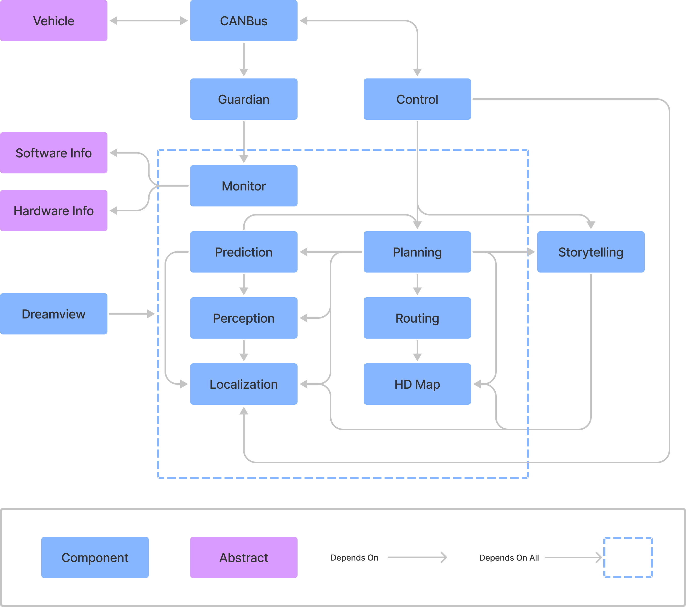
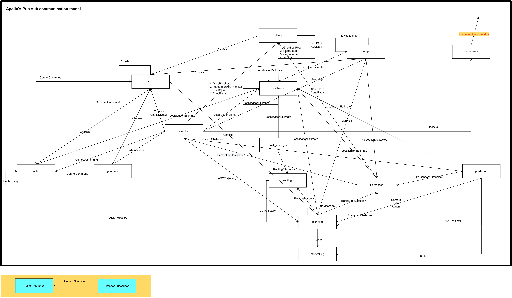
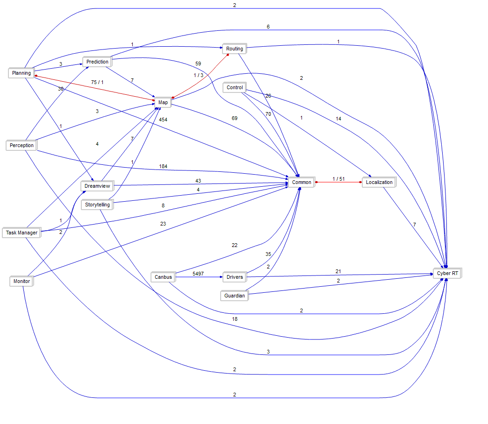
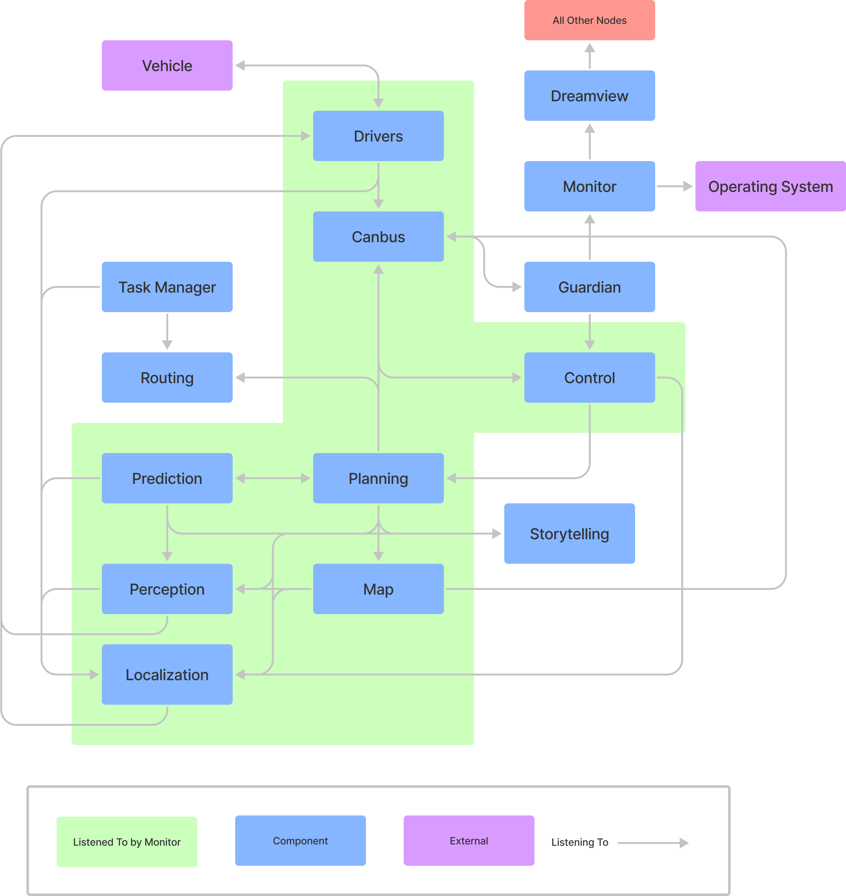
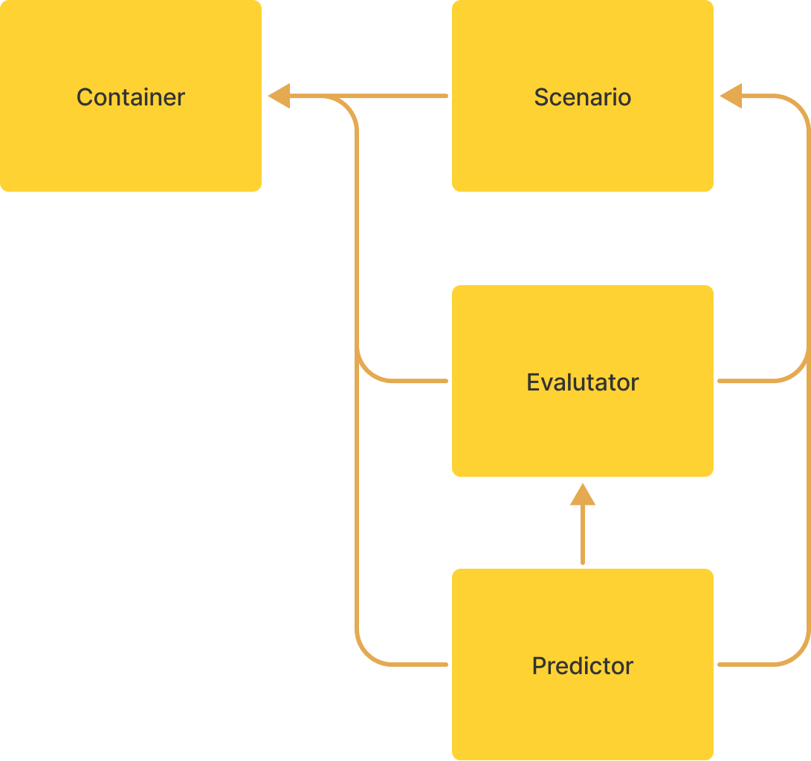
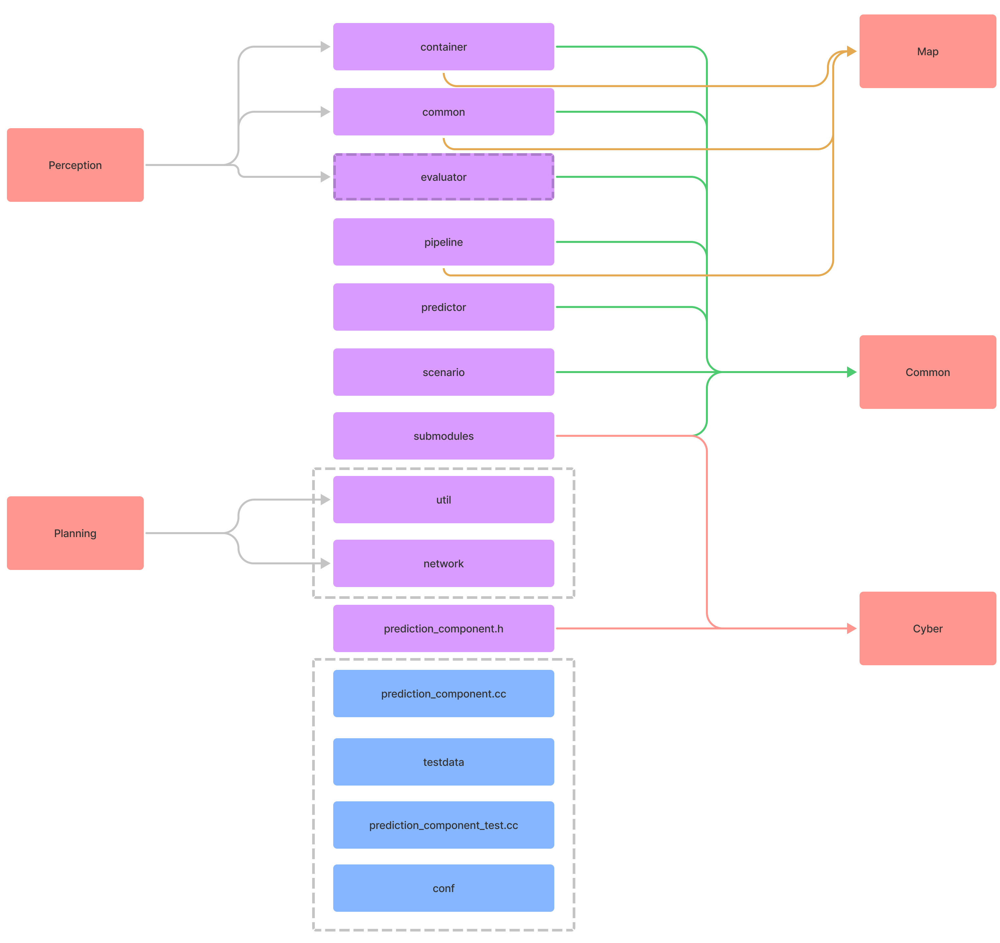
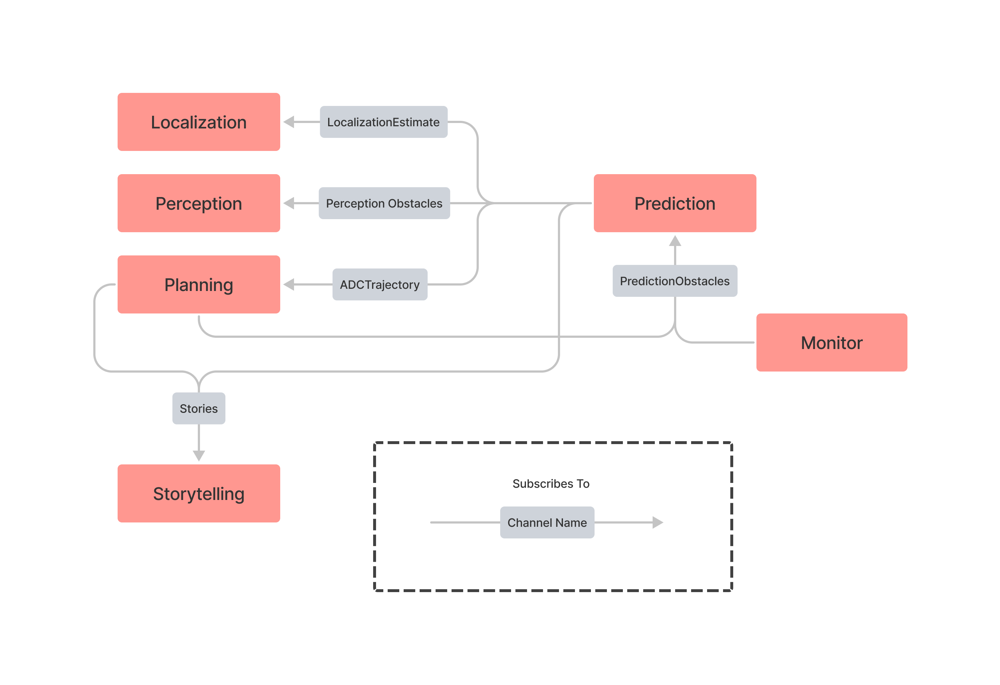
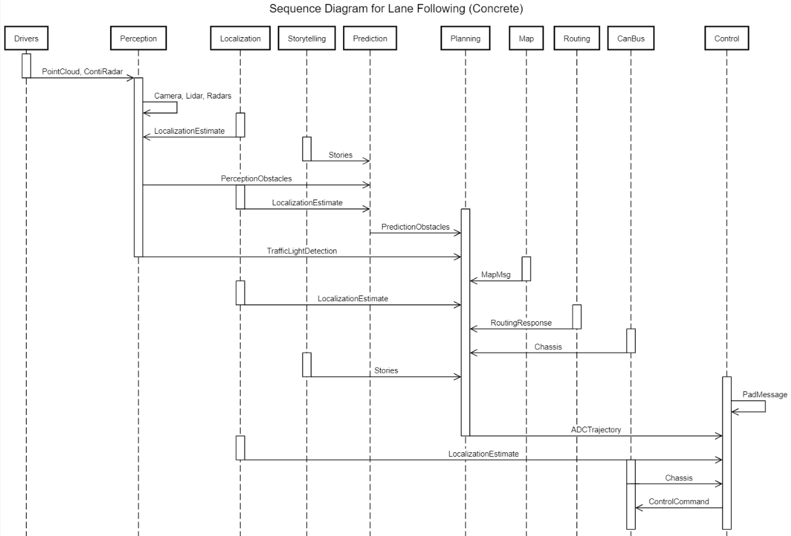
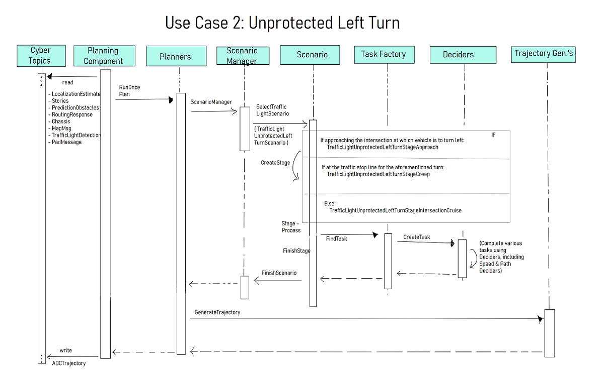

# The Concrete Architecture of Apollo

---

[Click here to access this report as a PDF. (Requires Queen's University login.)](https://queensuca-my.sharepoint.com/:b:/g/personal/18ehl_queensu_ca/EXZx1_JBhhhOtTpO5319qC4BMZwvnM5GDIMfOB-91dbkmg?e=udkOK1)  

[Click here to access the accompanying presentation slides. (Requires Queen's University login.)](https://queensuca-my.sharepoint.com/:p:/g/personal/18ehl_queensu_ca/EWv6vVayEZ1JtLu9hOiTiqMBP3R5K6xXsJnsqxrErZ2V6A?e=RwKWLu)  

<iframe width="560" height="315" src="https://www.youtube-nocookie.com/embed/F-1_0qCitWI" title="YouTube video player" frameborder="0" allow="accelerometer; autoplay; clipboard-write; encrypted-media; gyroscope; picture-in-picture" allowfullscreen></iframe>

---

## Abstract

As an open-source autonomous driving platform, Apollo understandably is a complex system. Having developed greatly over the years, its architecture has changed over time; thus, its concrete architecture may vary from the conceptual architecture derived from its documentation.  

To derive the concrete architecture, the Understand 5.1 tool, GitHub repository, and a publish-subscribe communication visualization diagram were utilized to determine dependencies between modules. This process confirmed the publish-subscribe, process-control, and client-server architectural styles determined in the conceptual architecture, but also added three new modules—Drivers, Common, and Task Manager—as well as updated the Map module; various discrepancies were found in the Reflexion Analysis process, including direct code dependencies.  

The Prediction submodule was also studied in this process, revealing that this module utilizes a combination of the object-oriented and publish-subscribe styles in its predicting of obstacle trajectories, with four core sub-modules: Container, Scenario, Evaluator and Predictor.  

## Introduction

Apollo is an open-source platform dedicated to the development and testing of autonomously driving vehicles. As a system that values security and safety while maintaining good performance, Apollo’s developers have created a complex system that largely uses the publish-subscribe style. The system contains a variety of subsystems that provide its functionality while satisfying its requirements, including a Perception module to determine obstacles and details, a Prediction module to predict how the surrounding world and obstacles may change, a Planning module that plans the vehicle’s trajectory, and a Control module that transforms the trajectory into commands for the vehicle to deploy. A conceptual architecture was created by studying a reference architecture [\[Behere and Törngren\]](https://www.sciencedirect.com/science/article/abs/pii/S0950584915002177) as well as utilizing Apollo’s documentation.  

Although the conceptual architecture may describe the system of Apollo to a degree, there are always limitations to what may be extracted via a reference architecture or system documentation. It may deviate from the reference architecture; the documentation may be a work in progress for the system’s current state, and/or omit minor dependencies. Thus, to fully understand Apollo, one must study its code to determine its concrete architecture.  

To derive the concrete architectures of both Apollo as a whole and our chosen subsystem, Prediction, we used the Understand tool at version 5.1, as well as a graph visualization of the publish-subscribe communication within the system, and in-depth investigation of the source code. Dependencies found within these visualizations were compared to our conceptual architecture, and discrepancies were added or removed as necessary. These discrepancies were studied in further detail to understand them in various ways, including their purpose and timing.  

Studying Apollo’s source code reveals three additional modules: Drivers, Task Manager and Common, as well as a module, Map, which contains a component of our conceptual architecture, HD Map, as a sub-component. In addition, although publish-subscribe remains largely what the system is built on, Apollo utilizes direct dependencies in its functionality, particularly to the Map module as well as a Common module, and various calls to include files from different components that help in other components’ function.  

## Derivation Process

Figures 1 and 2 visualize the conceptual architecture that was derived from Apollo documentation and the reference architecture. Figure 1 highlights the dependency relations between various modules, while Figure 2 emphasizes the architectural style that Apollo is largely built upon: the publish-subscribe style, where modules publish and subscribe to topics of interest as their main form of communication with one another.  

<figure markdown>
  
  <figcaption><b>Figure 1:</b> Dependency relations of the Apollo architecture, as determined in the conceptual architecture retrieval process.
(Corrected to match conceptual architecture report text.)</figcaption>
</figure>

<figure markdown>
  
  <figcaption><b>Figure 2:</b> Communication flow within the Apollo conceptual architecture.</figcaption>
</figure>

The conceptual architecture retrieved from various Apollo- and autonomous driving-related sources is an essential aspect of determining and understanding the concrete architecture used by the system. The process of deriving this conceptual architecture, as well as its details, may be found in our previous report. [\[OBEIA\]](https://obeia.github.io/assignment1/)  

### Understand, Publish-Subscribe and Reflection

One way to derive the concrete architecture of a system is by studying its source code, taking note of when modules and files within them reference other modules, suggesting a dependency.  

One method of doing so is via the Understand program. Using a file for this program provided by our instructor, we applied Understand 5.1’s dependency diagram tool; this process produces a visual of the dependencies of the system and allows one to view their specifics. However, due to the publish-subscribe style relying upon a central bus, many dependencies are obscured. To mediate this, our instructor provided another diagram, shown in Figure 3, representing the communication between modules in this style.  

Using these diagrams, we regularly considered our conceptual architecture, adding and removing dependencies as necessary; in considering these dependencies within Understand, we removed test files that did not affect the system itself. When reviewing discrepancies, we also discerned their purpose, timing, and attribution, if applicable, provided in Reflexion Analysis.  

In our study of the source code, three new modules or sub-components were found: a common module, a task manager, and drivers. Further, rather than HD Map, there is a “Map” module containing the HD Map as a sub-component. These modules are described in further detail with other subsystems of Apollo, within the Concrete Architecture section.  

The dependency diagrams and publish-subscribe visualization highlight many different dependencies through the system, notably various dependencies that do not occur within the publish-subscribe communication flow. Some dependencies recorded in our conceptual architecture were missing, whereas many unanticipated dependencies were found.  

<figure markdown>
  
  <figcaption><b>Figure 3:</b> Publish-subscribe communication visualization within Apollo.</figcaption>
</figure>

## Concrete Architecture

Figures 4 and 5 present the concrete architecture of Apollo’s software system as code dependencies, Figure 6 presents the architecture as messaging dependencies between modules. The architecture and interactions are described further in the following sub-sections.  

<figure markdown>
  
  <figcaption><b>Figure 4:</b> Apollo system inter-module code dependencies, according to Understand 5.1.</figcaption>
</figure>

<figure markdown>
  
  <figcaption><b>Figure 5:</b> Simplified view of Apollo inter-module dependencies.</figcaption>
</figure>

<figure markdown>
  
  <figcaption><b>Figure 6:</b> Publish-subscribe communication of the concrete Apollo architecture.</figcaption>
</figure>

### Modules and Subsystems

#### Cyber RT

Apollo’s architecture is built around a custom runtime framework called **Cyber RT**. Cyber RT has many responsibilities as both a runtime component and a base library for other system modules. At runtime, Cyber manages module loading and most of the inter- and even intra-module communication, through facilities for either publish-subscribe messaging or client-server interaction. Cyber RT also provides code dependencies, including runtime base classes, and utilities for file operations, logging, timing, concurrency, and asynchrony.  

The publish-subscribe functionality is done through a “channel” abstraction over multiple transport types, allowing it to be suited for various deployment scenarios. The `cyber::Reader` class template allows construction of subscribers to a channel and to receive messages on it, either declaring a callback function to trigger when a message is received or allowing messages to be cached for later observation. In many cases, the callback function is simply to store the message so a reference to the latest one is available for use. Publishing to a channel is handled by specializations of the `cyber::Writer` class template, which can write a single message type to a single channel. On the wire, exchanged messages are byte streams in the protocol buffer (protobuf) encoding format. Each module includes a collection of `.proto` files which define the messages it sends. Code is generated from the `.proto` files at build time, which is used by the publishing module for message serialization, and by the subscribing module(s) for deserialization.  

The Apollo runtime modules are made up of one or more Cyber RT “components”. There are two component base classes that a module can inherit from: `cyber::Component` (and its various partial specializations) and `cyber::TimerComponent`. Components inheriting from `cyber::Component` can declare zero to four message types to listen for and have their main processing logic automatically triggered when a message is received on those channels. Components inheriting from `cyber::TimerComponent` are instead triggered on certain time intervals. Either type of component can declare additional `Reader`s, and as many `Writer`s as required. All components must be registered with Cyber RT to operate.  

The fundamental nature of Cyber RT means that all other operating subsystems of Apollo depend on it.  

#### Common

While not a running module that provides specific functionality to the system, the Common module contains useful code that other modules may rely on. The contents include global constants (in the form of `gflags`) for topic names, vehicle configuration and data, access to system-wide parameters through a key-value database, latency recording and monitor logging, operation statuses, protocol buffer definitions that see use across the entire system, various math and parsing utilities, and a class that models the overall vehicle state, among others. [\[GitHub\]](https://github.com/ApolloAuto/apollo/blob/master/modules/common/README.md)  

As it is not a runtime module, Common does not exist as a Cyber RT component. Other than Cyber RT, every analyzed Apollo subsystem relies on Common.  

#### Drivers

The **Drivers** module contains code for interfacing with the various hardware components of the Apollo vehicle platform. It contains CAN client code, used both for reading from typical chassis sensors and controlling the vehicle. Additionally, it contains interfaces for the more advanced sensing equipment required for autonomous vehicle operation, including cameras, microphones, LiDAR, radar, and GNSS. These sensors are bridged into the rest of the system by Cyber RT components that write their readings to channels for other modules to read. Some Drivers components are subscribed to messages from the Localization and Canbus modules, relying on them for operational information.  

#### Guardian

**Guardian** acts as Apollo’s emergency response system, implemented as a Cyber RT `TimerComponent`. All messages from Control to Canbus pass through Guardian, which decides whether to block them based on vehicle and system status it receives from Canbus and Monitor. In the event of a system error, Control commands will be blocked, and Guardian will instead direct Canbus to bring the vehicle to a stop.  

#### Monitor

Monitor is a `cyber::TimerComponent` that regularly checks the status of the hardware and software of the system, using various mechanisms including OS-level process checks, and status messages on most Cyber RT channels. It reports results on the **SystemStatus** channel and is also able to directly update Dreamview.  

#### Dreamview

Apollo’s HMI module, **Dreamview**, includes a JavaScript frontend that allows users to visualize the data produced by other subsystems, and an on-board backend. Dreamview reads messages from all other modules and produces a three-dimensional representation of the vehicle including the current location and planned path and displays the status of the system components and hardware. Additionally, Dreamview contains a map service that other modules rely on, and an interface to allow certain HMI actions to be carried out.  

#### Perception

The **Perception** subsystem takes input from physical sensors mounted on a vehicle, including cameras, LiDAR sensors, and radar, over channels from the Drivers module. This subsystem outputs decisions on the state of nearby traffic lights and a list of objects which are labelled with their type, distance from the vehicle, and velocity. [\[GitHub\]](https://github.com/ApolloAuto/apollo/blob/master/modules/perception/README.md) The module is quite complex and includes ten different Cyber RT components.  

#### Prediction

The **Prediction** subsystem predicts the future movements of objects identified by the perception module, implemented as a `cyber::Component` that is triggered by the publishing of `PerceptionObstacles` messages. [\[GitHub\]](https://github.com/ApolloAuto/apollo/blob/master/modules/prediction/README.md) This module is described in more detail in the *Subsystem: Prediction* section of this report. In addition to Perception, the module reads from Storytelling, Map, and Localization subsystem channels.  

#### Planning

The **Planning** subsystem aims to plan the exact route of the vehicle. It first plans short term goals such as staying in a lane, then plans the future trajectory of the vehicle. The Planning module may request a new routing computation if unable to follow the original route. [\[GitHub\]](https://github.com/ApolloAuto/apollo/blob/master/modules/planning/README.md) Planning is subscribed to seven channels throughout the system; it is directly dependent on Dreamview, Routing, Localization, Prediction and Map.  

#### Localization

The **Localization** module provides localization services to the platform. This module consists of three different Cyber components that each implement a different localization strategy on what sensors are available to the vehicle, the data from which it reads from channels of the Drivers module; providing an estimate of the vehicle's location as output. [\[GitHub\]](https://github.com/ApolloAuto/apollo/blob/master/modules/localization/README.md)  

#### Map

The **Map** module includes the HD Map found within our conceptual architecture, which served as a query engine for the other modules to provide detailed road information. [\[GitHub\]](https://github.com/ApolloAuto/apollo/blob/master/docs/specs/Apollo_5.5_Software_Architecture.md) The Map also includes a PnC Map and Relative Map. [\[GitHub\]](https://github.com/ApolloAuto/apollo/tree/master/modules/map) It is subscribed to Localization, Canbus, and Perception topics, and has code dependencies on Routing and Planning.  

#### Routing

The **Routing** subsystem generates navigation paths, typically from the vehicle’s current location to the passenger’s destination. Another module can request for routing by publishing a `RoutingRequest`, which triggers the `RoutingComponent` (a child of `cyber::Component`). Routing’s logic additionally makes direct use of Map to produce a `RoutingResponse` which can be used by other modules, notably Planning. [\[GitHub\]](https://github.com/ApolloAuto/apollo/blob/master/modules/routing/README.md)  

#### Canbus

Acting as the interface between the software system and the physical chassis, **Canbus** works closely with the Control and Guardian modules, subscribing to and actualizing commands from one of them according to a configuration flag. Canbus also reports the chassis status to the rest of the system and relies heavily on code in Drivers in its operation. [\[GitHub\]](https://github.com/ApolloAuto/apollo/blob/master/modules/canbus/README.md)  

#### Storytelling

The **Storytelling** subsystem is a scenario manager intended to coordinate inter-module actions. This module creates “stories”: complex scenarios that may be used by other modules. [\[GitHub\]](https://github.com/ApolloAuto/apollo/blob/master/modules/storytelling/README.md) This sub-system does not subscribe to any module topics but does write to topics of its own; it is dependent directly on the Map module.  

#### Control

The **Control** subsystem employs various algorithms to generate control commands for the steering, brakes, and throttle, depending on the scenario the vehicle is in. Control passes the commands to the Canbus to control the vehicle hardware. [\[GitHub\]](https://github.com/ApolloAuto/apollo/blob/master/modules/control/README.md) It is subscribed to topics from Planning and Canbus; it both subscribes to topics of and directly depends on Localization.  

#### Task Manager

The **Task Manager** contains various routing managers to be employed by the system as required. It writes to a `RoutingRequest` channel if the routing process needs to be redone. [\[GitHub\]](https://github.com/ApolloAuto/apollo/tree/master/modules/task_manager) It is subscribed to topics from the Routing and Localization modules and is directly dependent upon Dreamview and Map.  

### Architectural Styles

Recovering Apollo’s concrete architecture confirmed that publish-subscribe served as the primary form of communication between modules; the method of how it is applied was described in detail previously in the Cyber RT subsystem description.  

The process-control pattern was confirmed in the concrete architecture, with the Control module acting as the controller, while Canbus acts as the process; here, the Control module creates execution plans, which the Canbus reads and actualizes for the hardware, then provides Chassis data (i.e., feedback) to Control.  

Finally, the client-server style of interaction via Cyber RT was confirmed; the Cyber RT API for Developers discusses the process in detail, in that it implements two-way communication in this fashion where a node sends a request to receive a response. [\[GitHub\]](https://github.com/ApolloAuto/apollo/blob/master/docs/cyber/CyberRT_API_for_Developers.md#service-creation-and-use) The Routing channels `RoutingResponse` and `RoutingRequest` are one such example of this style.  

## Reflexion Analysis

Upon comparison between our conceptual publish-subscribe architecture and the concrete one, several discrepancies were identified in inter-module messaging dependencies. *Table 1* describes the expected dependencies that were found to be absent in the concrete architecture. *Table 2* describes the concrete dependencies that were not expected in the concrete architecture.  

**Table 1:** Conceptual dependencies absent in concrete architecture.  

| Listener Module | Talker Module | Discrepancy Details |
| --- | --- | --- |
| Control | Storytelling | The expectation for Control having a dependency on Storytelling came from the Storytelling documentation listing Control as an example of a module that might subscribe to a story. At this time, there is only one story implemented in Storytelling, which does not require Control to be subscribed. Since any module could subscribe to Storytelling as more stories are implemented, this dependency might exist in the future. |
| Routing | Map | This expected dependency is not necessarily absent, it instead takes a different form than initially expected. It was expected that communication between Routing and Map would be carried out over Cyber’s publish-subscribe or client-server transports. Instead, it appears to be a direct code dependency. |
| Storytelling | Localization | In 2020, this dependency was recorded in the README file for Storytelling ([09a4f00](https://github.com/ApolloAuto/apollo/commit/d25a5746b870f350d11a2f87709f9b9862546763)); however, study of the code at this period of time reveals direct dependencies to Planning and Prediction that have been removed since, but not Localization either through code or messaging.
| Storytelling | Map | This expected dependency is not necessarily absent, it instead takes a different form than initially expected. It was expected that communication between Storytelling and Map would be carried out over Cyber’s publish-subscribe or client-server transports. Instead, it appears to be a direct code dependency. |

**Table 2:** Dependencies found in concrete architecture not expected by conceptual.  

| Listener Module | Talker Module | Discrepancy Details |
| --- | --- | --- |
| Drivers^1^ | Canbus | The `gnss::RawStream` class of the `GnssDriverComponent` is subscribed to `Chassis` messages. On a timer, it extracts speed data from the message and writes a corresponding wheel velocity command to the command stream. |
| Drivers^1^ | Localization | The `ContiRadarCanbusComponent` is subscribed to `LocalizationEstimate` messages to extract the vehicle's pose data. Specifically, it uses orientation and linear velocity to calculate a speed and yaw rate, as required by the radar hardware. |
| Guardian | Canbus | Guardian is subscribed to `Chassis` messages from Canbus so it can check for sonar faults and obstacles in the event of an emergency stop when safety mode is triggered. If either are found, the vehicle is supposed to make a hard emergency stop, otherwise a soft one can be made. However, since a change in June 2018, these flags are ignored pending “hardware re-alignment.” ([97b0b3c](https://github.com/ApolloAuto/apollo/commit/97b0b3c5efca8da07d30ed15b3a111ca08256b75#diff-4e1a1bbbd78f9cb83e4db62d0195c6d2118eecc61e66bf56cb338019b6b10e54R132-R137)) |
| Guardian | Control | Guardian listens for `ControlCommand` messages from Control. When the system is not in safety mode, the `ControlCommand`s are wrapped in a `GuardianCommand` and published for Canbus to receive. When safety mode is enabled, the commands are blocked from reaching Canbus. Our assumption had been that the safety mode control logic existed in Canbus, which listened for commands from Control and a safety mode state from Guardian and considering both, rather than the commands passing through Guardian. |
| Localization | Drivers^1^ | The Localization module relies on sensor data from Drivers in the form of `GnssBestPose`, `PointCloud`, `CorrectedImu`, and `InsStat` messages. |
| Map | Canbus | `Chassis` messages from Canbus are listened for by the `RelativeMap` submodule of the Map component. In part of creating the relative map, it uses `Chassis` and `LocalizationEstimate` data to update the vehicle state. |
| Map | Localization | `LocalizationEstimate` messages from Localization are listened for by the `RelativeMap` submodule of the Map component. In part of creating the relative map, it uses `Chassis` and `LocalizationEstimate` data to update the vehicle state. |
| Map | Perception | `PerceptionObstacles` messages from the Perception module that contain lane marker data are used by the `RelativeMap` submodule of the Map component to create one or more navigation paths in the relative map. |
| Monitor | Canbus | Initial analysis during the development of the conceptual architecture concluded that Monitor’s monitoring of other Apollo modules was primarily achieved by channel utilities provided by Cyber RT, and operations at the operating system level such as checking system resource usage and that processes are running. While those are all methods that Monitor employs, it also subscribes to topics of various modules to look out for anomalous activity.
| | Control | |
| | Dreamview | |
| | Drivers^1^ | |
| | Localization | |
| | Map | |
| | Perception | |
| | Planning | |
| | Prediction | |
| Perception | Drivers^1^ | The Perception module receives LiDAR and radar data in the form of `PointCloud` and `ContiRadar` messages, respectively, from the Drivers module. |
| Planning | Canbus | Planning listens for `Chassis` messages containing details of the vehicle state. The chassis data is combined with data from the other subscribed inputs as a `LocalView`, which “contains all the necessary data as planning input.” This input is not listed as a data input in the Planning documentation, so it was not considered in the conceptual architecture. |
| Prediction | Storytelling | Prediction is subscribed to `Stories` messages from Storytelling, in order to be a part of cross-module coordination when a story scenario occurs. Prediction was not listed in the Storytelling documentation as an example subscriber, but any module could potentially be a story subscriber, depending on which stories have been implemented. The only story implemented so far is `CloseToJunction`, which requires Prediction. |
| Task Manager^2^ | Localization | The Task Manager listens for `LocalizationEstimate` messages, which it uses for vehicle positioning data. The vehicle coordinates are used to determine the distance to waypoints in cycle and dead-end routing tasks. |
| Task Manager^2^ | Routing | The Task Manager subscribes to `RoutingResponse` messages to confirm that routing requests that it has made have succeeded. |

1. Drivers had not been included in the conceptual architecture as a module, as such all publish-subscribe interactions involving it appear as a divergence.  
2. Task Manager had not been included in the conceptual architecture as a module, as such all publish-subscribe interactions involving it appear as a divergence.  

### Code Dependencies

Even in Apollo’s publish-subscribe architecture, the modules and subsystems are not fully isolated or independent. One category of such code dependency makes complete sense, which is any dependency on the Common or Cyber modules. As described previously, these modules both provide utilities and runtime functionality, and are meant to be relied on in this way.  

Another category of inter-module code dependency comes from the use of protocol buffers. Every module that publishes messages includes `.proto` definitions that are used to generate protobuf serialization code at build time. Subscribing modules that need to deserialize the protobuf messages must rely on this generated code as well, which can be seen as `#include`s for files ending in `.pb.h`. This sort of dependency between modules is a requirement of the system, and the benefits of using strict schemas enforced by generated code at the expense of full module isolation far outweigh the benefits of full isolation but requiring either unstructured messages or duplicated message class code. However, one case where this is less expected is in the `VehicleStateProvider` class of the Common module, which depends on `Chassis` and `LocalizationEstimate` protobuf code from Canbus and Localization, respectively, as well as in the accompanying `vehicle_state.proto` which relies on `chasis.proto` and `pose.proto` from the same respective modules. It is unusual for a common module to depend on more specific functional modules, even in this way.  

Other code dependencies that were found are detailed in Table 3.  

**Table 3:** Other inter-module code dependencies.  

| Dependent Module | Dependency Module | Dependency Details |
| --- | --- | --- |
| Canbus | Drivers | The Canbus module depends heavily on the Drivers module, specifically the `drivers/canbus/` subdirectory. The `drivers/canbus/` directory contains CAN client code, such as the base `CanClient` class, specific CAN client implementations that inherit from `CanClient`, and the `CanClientFactory` that registers the clients. The CAN client code used to be part of the Canbus module but was moved to `drivers/` since different sensors using the protocol all share use of it. ([10fb2bf](https://github.com/ApolloAuto/apollo/commit/10fb2bfb9c1c6c94f1fdbb071326560a5f62620b)) |
| Common | Localization | Common declares a dependency on the `localization_gflags.h` file in the implementation of the `VehicleStateProvider` class. The value of this flag is used to choose how to determine the linear acceleration and angular velocity of the vehicle. It is, however, quite odd to see a “common” module depend on a specific subsystem. |
| Control | Localization | The `LonController` class in the Control module includes the `localization_gflags.h` file but does not appear to make use of the flags anywhere. The inclusion dates to Apollo 1.0 and the earliest commit in the codebase, but the flags go unused there and in every revision since. The dependency is unnecessary. |
| Dreamview | Map | Dreamview’s `MapService` makes use of both `hdmap::PncMap` and `hdmap::HDMap` (via `hdmap::HDMapUtil`), querying both map models for routing information and road features such as lanes, speedbumps, signs, etc. Additional use of Map classes is used in simulation functionality. |
| Map | Planning | The `hdmap::PncMap` class includes `planning_gflags.h` from the Planning module since December 2017. ([4abd4e3](https://github.com/ApolloAuto/apollo/commit/4abd4e31874b12ec6a9298144d0226943abdf5ea#diff-f5c16659754548356f9421e58b492c5bdc9af5e663e8fbe01960dd7f7e2ddebaR39)) The class logic continues to make use of these flags. |
| Map | Routing | At one time, the `hdmap::PncMap` class was made dependent on one of the flags from `routing_gflags.h`. ([1effd0c](https://github.com/ApolloAuto/apollo/commit/1effd0c44c7b95ede8395f577fcc90f8aa5b13b1#diff-f5c16659754548356f9421e58b492c5bdc9af5e663e8fbe01960dd7f7e2ddebaR444)) However, the use of this flag was later modified, then removed entirely. ([b3ce40c](https://github.com/ApolloAuto/apollo/commit/b3ce40ccc3905203648039a467c9926f74fbecdd#diff-f5c16659754548356f9421e58b492c5bdc9af5e663e8fbe01960dd7f7e2ddebaL275)) No other Routing flags are used by this class, making the dependency unnecessary. |
| Monitor | Dreamview | The `MonitorManager` class has a dependency on the `dreamview::HMIWorker`, which is a singleton object, as well as on `dreamview_gflags.h`. The `HMIWorker` singleton is used to update configs and monitored modules when the HMI status reports a mode change. |
| Perception | Map | Perception contains the `perception::map::HDMapInput` class, which is a thread-safe singleton wrapping `HDMap` for use by the many subcomponents of Perception, including various sensors that need map data, and for sensor fusion. The wrapper includes `hdmap.h`, `hdmap_common.h`, and `hdmap_util.h`. |
| Perception | Prediction | The Perception module’s multi-LiDAR fusion engine and evaluator manager make use of classes from the Prediction module. The former using the obstacles and pose containers and the latter relying on the semantic LSTM evaluator. This appears to be a case of specialized code reuse for the evaluator use case and not a runtime module interaction. |
| Planning | Dreamview | `planning::OpenSpaceRoiDecider` declares a dependency on `dreamview::MapService`, however it is unclear why. It does not appear to be used. It is possible that the dependency being unused, or the location of its use, is lost in the size of the commit it was introduced in. ([6db2a1b](https://github.com/ApolloAuto/apollo/commit/6db2a1bc66ca3d564c18545c8ff8ebd0762249e7#diff-8f9683163d73700aa72216f7b7316d8f4a2f8e372e9d6501ce9711b0edcb0021R35)) |
| Planning | Map | The Planning module makes significant use of elements of all three submodules of the Map system, relying on the HD Map, PnC Map, and relative map for road and environment details in navigation planning. |
| Planning | Prediction | `AutotuningMLPModel` in Planning extends `prediction::network::NetModel`, which is a base class for implementing machine learning network models. This is a case of code reuse not module interaction at runtime, but the base class could be considered for extraction into a common library. |
| Planning | Routing | The `planning::ReferenceLineProvider` class declares a dependency on `routing_gflags.h` from the Routing module, since the class logic relied on one of the flags. ([b3ce40c](https://github.com/ApolloAuto/apollo/commit/b3ce40ccc3905203648039a467c9926f74fbecdd#diff-caddaceec5859aad9064cf1bb97836aac682611cc7d0bce0538ebcf15189a77eR113)) The method where the flag was used was later made unreachable, ([c488562](https://github.com/ApolloAuto/apollo/commit/c488562a20db1ba65a904530b208307dd7bd2342#diff-caddaceec5859aad9064cf1bb97836aac682611cc7d0bce0538ebcf15189a77eL302)) and the dead code was removed some time later. ([c0331f9](https://github.com/ApolloAuto/apollo/commit/c0331f92d777c0b8ebf1b1e81e16618b4f0c9ac3#diff-caddaceec5859aad9064cf1bb97836aac682611cc7d0bce0538ebcf15189a77eL75-L131)) However, the dependency was not removed, despite now being unnecessary. |
| Prediction | Map | The Prediction module makes use of HD Map as part of its prediction map and semantic map. The primary interaction appears to be positioning and predicting the movement of obstacles relative to lanes, with lane details coming from Map. |
| Routing | Map^1^ | The `routing::Routing` class declares a dependency on `hdmap_util.h` from the Map module. It uses a utility from there to get the routing map file to construct a `Navigator`, and another to receive a pointer to the `HDMap` object, which it uses to query lanes and parking spaces. |
| Storytelling | Map^1^ | The `storytelling::CloseToJunctionTeller` class makes use of the `hdmap::HDMapUtil` class querying details of the surroundings when approaching an intersection. |
| Task Manager | Dreamview | `task_manager::CycleRoutingManager` uses a dependency on `dreamview::MapService` to construct lane waypoints when getting new routing at the beginning/end of a cycle. |
| Task Manager | Map | Task Manager’s `DeadEndRoutingManager` and `ParkingRoutingManager` declare several dependencies on HD Map classes but make no use of them. Like the earlier Planning/Dreamview dependency this was introduced in a very large, squashed commit and it seems likely that the unnecessary dependencies went unnoticed. ([6db2a1b](https://github.com/ApolloAuto/apollo/commit/6db2a1bc66ca3d564c18545c8ff8ebd0762249e7)) |

1. This dependency is notable since in the initial conceptual architecture analysis it was assumed that the communication was done either by the pub-sub channels or Cyber RT’s client-server mechanism. However, it appears to simply be a code dependency.

## Subsystem: Prediction

In studying the architecture of Apollo, we chose to study one of its core subsystems, the Prediction module, in further detail. This entailed deriving its conceptual architecture, and then forming its concrete architecture, applying the reflexion analysis in the process.  

### Subcomponents

#### Container

The **Container** stores input data that the Prediction module listens for from subscribed topics; currently, these are Perception obstacles, Planning, and Localization. [\[GitHub\]](https://github.com/ApolloAuto/apollo/blob/master/modules/prediction/README.md#container)  

#### Scenario

The **Scenario** sub-module defines scenarios that the ego vehicle may be in; currently these scenarios are *cruising*, which includes lane keeping and following, and *junction*, which includes intersections with traffic lights and/or stop signs. [\[GitHub\]](https://github.com/ApolloAuto/apollo/blob/master/modules/prediction/README.md#scenario)  

#### Evaluator

The **Evaluator** separately predicts the path and speed of each obstacle and evaluates them by outputting a probability that they occur by using a given model. It uses a variety of possible evaluators, and most apply machine learning to determine these probabilities; the models utilized in these machine learning evaluators include RNN, MLP, CNN-1d and social LSTM. For example, the Semantic LSTM Evaluator, used for “caution”-level obstacles, generates short-term trajectory points via CNN and LSTM. [\[GitHub\]](https://github.com/ApolloAuto/apollo/blob/master/modules/prediction/README.md#evaluator)  

#### Predictor

The **Predictor** generates predicted trajectories. A variety of possible predictors are supported, including *empty*, for obstacles with no predicted trajectories; *single lane*, where they move along a single lane in “highway navigation mode;” *lane sequence*, where they move along the lanes; *move sequence*, moving along the lanes “following its kinetic pattern;” *free movement*; *regional movement*, moving in a possible region; and *junction*, moving toward junction exits. An *interpolation predictor* computes the likelihood of creating posterior prediction results after all evaluators have run, intended for “caution”-level obstacles. An *extrapolation predictor* creates an 8 sec trajectory, extending the Semantic LSTM Evaluator. [\[GitHub\]](https://github.com/ApolloAuto/apollo/blob/master/modules/prediction/README.md#predictor)  

### Conceptual Architecture

To derive the conceptual architecture of the Prediction module, we studied its documentation. The documentation, found in the module README file, provided details on each core sub-module, as well as a diagram presenting their communication and control flow.  

<figure markdown>
  
  <figcaption><b>Figure 7:</b> Conceptual architecture of the Prediction module.</figcaption>
</figure>

### Concrete Architecture

As with the concrete architecture of the full system, we studied the dependency diagram formulated by Understand to derive specific dependencies of the system. This, however, has limitations regarding publish-subscribe communication between Prediction’s sub-modules and other modules in the system, as the provided publish-subscribe visualization does not go into such detail. However, a study of the main sub-modules’ code presents that the Evaluator and Predictor modules have publish-subscribe dependencies to other modules.  

<figure markdown>
  
  <figcaption><b>Figure 8:</b> Concrete architecture for the Prediction module.</figcaption>
</figure>

<figure markdown>
  
  <figcaption><b>Figure 9:</b> Publish-subscribe communication focused on the Prediction module.</figcaption>
</figure>

### Architectural Styles

The visual representation of the subcomponent communication reviewed in the conceptual architecture derivation process led us to conclude that the object-oriented style would fit the architecture. This is as the sub-modules would need to know the identities of one another. The Container identifies and protects specific input data; the other sub-modules may use these specific data, i.e., they need to know which data is which, and from which source it is from. This is supported by direct includes in the code to specific Containers in the concrete architecture.  

In addition to the object-oriented style, Prediction employs some publish-subscribe communication, both in terms of inter-module and intra-module communication. In particular, the Evaluator and Predictor listen for specific topics, which can be seen in their submodule code.  

### Reflexion Analysis

Many major discrepancies from conceptual to concrete architecture of the Prediction module are the addition of new sub-modules. These include Submodule Output, Util (Data Extraction), Network, Pipeline (Vector Net), Prediction Common, and the Core/Main Files modules. It was expected that the Vector Net would have been stored within the Evaluator; the Core/Main Files “module” serves as the main form of reading publish-subscribe messages, as well as writing final Prediction output. Thus, any dependencies to or from these modules were unexpected.  

There were two dependencies between sub-modules that were seemingly absent in the concrete architecture. The first was the dependency from Predictor to Evaluator; this was displayed as a direct sequential flow in the visualization within the README. However, comments in the Predictor sub-module suggest that this dependency exists, but instead in a publish-subscribe communication format. [\[GitHub\]](https://github.com/ApolloAuto/apollo/blob/master/modules/prediction/submodules/predictor_submodule.h) The other discrepancy was the dependency from Evaluator to Scenario; as with the other dependency, this was expected due to the README, but was missing. As Evaluator largely uses machine learning in its implementation, generating various paths and corresponding probabilities, the scenario may not be as relevant.  

Inter-module publish-subscribe topics were expected to be read by the Container, as it stores their input data; however, this is absent in the concrete architecture. Instead, these topics are read by the Prediction component’s Core/Main Files. This module also publishes to the `ADCTrajectoryContainer` and `SubmoduleOutput` used by the Evaluator and Predictor. The Container, included in the Main Files, processes the received data from the main Prediction component file via `ContainerSubmoduleProcess`, rather than receiving it itself.  

Finally, various unanticipated direct dependencies from the sub-modules to other modules may be found. All four original modules depend on the Common module; the Evaluator and Predictor are Cyber RT components. The Container directly includes the Map, by including the `hdmap_common.h` file for its obstacles and obstacle clusters.

## Use Cases

### Use Case 1: Lane Following

<figure markdown>
  
  <figcaption><b>Figure 10:</b> Sequence diagram for the lane following use case, in accordance with the concrete architecture.</figcaption>
</figure>

In this first use case of lane following, the vehicle stays within a lane while following another car at a safe distance. The diagram in Figure 10 highlights the flow of publish-subscribe channel data. First, the Perception module reads subscribed Drivers messages, which it processes; using the `LocalizationEstimate`, as well as more sensor data, it determines the perceived obstacles and traffic light status, if applicable. Using published `Stories`, `LocalizationEstimate`, `PerceptionObstacles`, and the `ADCTrajectory` of the previous cycle, the Prediction module predicts trajectories for the obstacles. The Planning module then plans a trajectory using the `PredictionObstacles`, `TrafficLightDetection`, `Stories`, `LocalizationEstimate`, `MapMsg`, `RoutingResponse`, and `Chassis`; it publishes the trajectory to the `ADCTrajectory` channel. This is used by the Control module, in addition to the `Chassis` and `LocalizationEstimate`, to create control commands. The Canbus then reads the `ControlCommand` to send them to the hardware.  

### Use Case 2: Unprotected Left Turn

<figure markdown>
  
  <figcaption><b>Figure 11:</b> Sequence diagram for the Unprotected Left Turn use case, centered upon the Planning component.</figcaption>
</figure>

Use Case 2 is the Unprotected Left Turn scenario. In this scenario, the vehicle is to turn left at an intersection with a traffic light; “unprotected” refers to how the traffic light is not using specific turn lights (i.e., left-only). Figure 11 presents a sequence diagram for this use case, which was created after a study of the Planning component code. After the Planning component reads messages from Localization, Storytelling, Prediction, Routing, Canbus, Map, Perception, and itself, it runs various planners once to plan trajectories. These planners use a Scenario Manager, creating the scenario as well as its current stage (Approach if not yet at the intersection, Creep to move forward and survey, and Intersection Cruise to move through). Tasks are found in a Task Factory, including deciding on the speed and path. Once this is complete, the stage, and then scenario, is finished; the Planners generate the trajectory using trajectory generators, and the optimal trajectory is written to the `ADCTrajectory` topic. [\[GitHub\]](https://github.com/ApolloAuto/apollo/tree/master/modules/planning)  

## Lessons Learned

Certain unexpected things complicated the architecture derivation process. Firstly, Understand is unable to detect protobuf dependencies, which means some module dependencies are obscured since they occur in code generated from the protobuf files. Second, the Apollo developers do not write very descriptive commit messages, and most pull requests that were looked at as being relevant to our investigation had no description.  

Apollo, being a large system, has various modules that are regularly updated over time, and the documentation is not necessarily updated with it; in addition, it may be simplified to the true state of the system for readability purposes or complexity.  

## Glossary

**HMI:** Human Machine Interface  
**LiDAR:** Light Detection and Ranging  
**Conti radar:** A radar sensor from Continental Engineering. Specifically, Apollo uses the Continental ARS-408-21 Radar package.  
**PnC:** Planning and Control  
**CAN:** Controller Area Network. A host-less messaging bus protocol primarily used with microcontrollers in automotive contexts.  

## References

ApolloAuto. “ApolloAuto/apollo: An open autonomous driving platform.” GitHub. Last accessed March 21, 2022. Retrieved from https://github.com/ApolloAuto/apollo.  

ApolloAuto. “Planning README at 5.5.0.” GitHub (2020). Retrieved from https://github.com/ApolloAuto/apollo/blob/r5.5.0/modules/planning/README.md.  

Behere, Sagar, and Martin Törngren. “A functional reference architecture for autonomous driving.” KTH The Royal Institute of Technology, Brinellvägen 83, Stockholm SE-10044, Sweden (2015): 143. Retrieved from https://www.sciencedirect.com/science/article/abs/pii/S0950584915002177.  

OBEIA. “The Conceptual Architecture of Apollo.” February 20, 2022. Retrieved from https://obeia.github.io/assignment1/.

