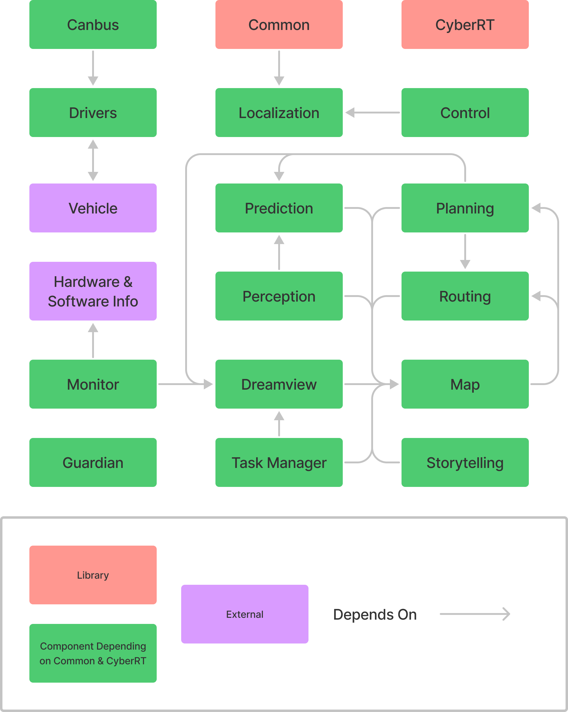
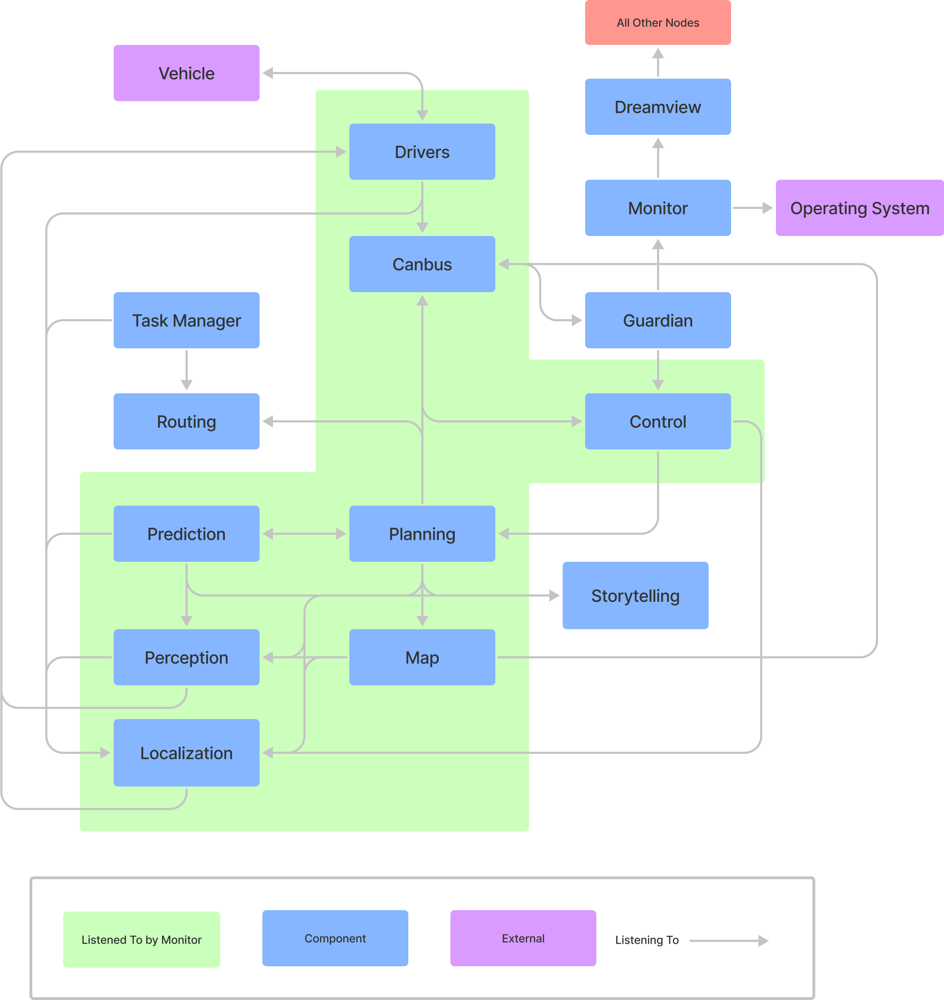
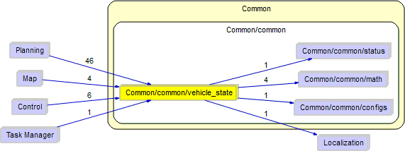

# Apollo & the Vehicle State Provider: A Suggestion for Enhancement

---

[Click here to access this report as a PDF. (Requires Queen's University login.)](https://queensuca-my.sharepoint.com/:b:/g/personal/18ehl_queensu_ca/EXIg_kVnpAJFg-24thRx2SMBWtwWonCIoqHSyDZupjEntA?e=lJhNjE)  

[Click here to access the accompanying presentation slides. (Requires Queen's University login.)](https://queensuca-my.sharepoint.com/:p:/g/personal/18ehl_queensu_ca/Ee55ac2UUGxFvDrBS5O-wvMBkDLrRH5nFnXmhSPRK57UNQ?e=RZgcG8)

<iframe width="560" height="315" src="https://www.youtube-nocookie.com/embed/dq0srBG1XNE" title="YouTube video player" frameborder="0" allow="accelerometer; autoplay; clipboard-write; encrypted-media; gyroscope; picture-in-picture" allowfullscreen></iframe>

---

## Abstract

Apollo is an open-source autonomous driving platform supporting the development of systems for self-driving vehicles. Having been built and continually refined over many years, Apollo’s architecture has understandably developed idiosyncrasies. As an improvement to the software system’s architecture, we propose introducing a new module to be solely responsible for vehicle state.  

As well as proposing this new module and its functionality, we outline two potential implementations for realizing it following paradigms already present in the Apollo system. We then assess these potential implementations according to SAAM, as outlined by Kazman, Bass, Abowd, and Webb, to determine which is the most desirable approach. Our final determination is to continue with the primarily publish-subscribe architecture present in Apollo for the implementation of the new module. We finally review the risks that the selected implementation introduces and propose strategies, including a testing strategy, to mitigate these risks.  

## Introduction

Apollo is a platform dedicated to the development of autonomous vehicles, which continues to be in development itself. The complexity of autonomous driving combined with vehicle hardware brings intricate detail that has been, and must continue to be, considered as the system develops. To implement the system, Apollo’s developers have utilized a largely publish-subscribe-based approach, creating components that are mainly decoupled, for functionality and enhancement. These components include a Planning module to plan a trajectory based on various factors such as perceived obstacles, traffic light status, and the route created by the system’s Routing module; a Control module that transforms the Planning module’s trajectory into commands for the vehicle to execute; and a Map module that holds various maps to be utilized in the system, including a “relative map” that is relative to the vehicle.  

Apollo is a system with a variety of valued non-functional, quality-based attributes; these include performance, modifiability, and reliability. As a platform for autonomous driving, performance and reliability of utmost importance: if the system does not perform well, such as within a certain timeframe, or is not reliable enough in its results, it can be unsafe for a vehicle to use on the road, meaning that it must be refined. The system must also be modifiable to suit other developer’s needs, such as to create new scenarios to plan for, or to utilize in implementations for specific vehicles. This suggests that Apollo’s architecture and design needs to be easy for other developers in this field to understand and modify.  

Apollo includes a variety of utilities and objects within its system’s Common module, with one being the aptly named vehicle state provider. It provides information relating to the vehicle’s state to modules that utilize this data in calculations, such as for planning a trajectory or generating control commands. However, the vehicle state is updated by other modules as they receive or process appropriate input. The vehicle state provider’s strange placement as a Common utility should be reviewed to determine if an enhancement can be made to improve the system, such as to improve modularity and testability. It is the subject of our proposed enhancement, described in the following in more detail.  

## Proposed Enhancement

The vehicle state provider is a singleton object in the Apollo system that provides several other modules with a simplified and aggregated view of the state of the vehicle. Specifically, a `VehicleState` is a protobuf-defined class that combines elements of the `Chassis` and `LocalizationEstimate` message types, including vehicle position coordinates and kappa; pitch, roll and yaw angles; heading; linear and angular velocity and acceleration; driving mode; gear and steering wheel position; and the vehicle pose. The vehicle state provider maintains this model of the vehicle state and provides methods for querying the state properties. Updates to the vehicle state are performed when needed by other modules invoking the `VehicleStateProvider::Update` method with a `LocalizationEstimate` message and a `Chassis` message as arguments, from which all `VehicleState` properties are recalculated. The two messages are read by the invoking module from the correspondingly named Cyber RT channels, which are written to by the Localization and Canbus modules, respectively.  

The vehicle state and provider are currently found in the `modules/common/vehicle_state` directory of the Apollo codebase. The provider class is `common::VehicleStateProvider`, defined and implemented in the `vehicle_state_provider.h` and `vehicle_state_provider.cc` files, with accompanying unit tests in `vehicle_state_provider_test.cc`, all in the root of the aforementioned directory. The vehicle state model is defined in a protocol buffer definition file, `modules/common/vehicle_state/proto/vehicle_state.proto`, from which the C++ code for the `common::VehicleState` class is generated at build time by the protocol buffer compiler. As can be gathered from the code location and class namespace, the vehicle state provider exists within Apollo's Common module, which is otherwise responsible for providing other Apollo modules with generic utilities and global constants and is meant to be consumed as a dependency library. The inclusion of a specialized dynamic runtime data service in a common library module would be considered bad design practise by many. Even more so when the implementation of said service requires the Common module to take a dependency on a more specialized system component as is the case here, since the design paradigm of common modules typically allows them only to depend on external libraries.  

Given the abnormality in the architecture that the vehicle state provider introduces by being a part of the Common module, our suggested enhancement is its refactoring and isolation as a new module unto itself in the Apollo system.  

### Motivation

As described previously, the inclusion of the vehicle state provider as a part of the Common module is an architectural abnormality and case of bad design practise in Apollo. It is against the commonly accepted design paradigm of a shared utilities library, such as the Common module, to take dependencies on other, non-generic application modules. Common practice dictates that such library modules only depend on themselves, the language or runtime standard library, and external third-party dependencies (usage of which can be simplified for the rest of the project through the shared library). In this case, inclusion of the vehicle state provider requires dependencies on both the Canbus module via use of generated protobuf code for `Chassis` data, and the Localization module via use of generated protobuf code for `LocalizationEstimate` data as well as direct usage of Localization constants and configuration state flags. Furthermore, the vehicle state provider is, as its name suggests, a stateful runtime data service, that receives both updates and queries over the lifetime of a running Apollo process. That is also irregular as a part of a common shared library, which tend to contain stateless utilities, wrappers, and static or constant data. An earlier form of the vehicle state provider exists as far back as the initial commit to the Apollo repository, so it is hard to tell for certain, but its location as part of Common is possibly a case of “junk drawer” degradation in a commons library, where anything that does not find an immediate other location is added to the commons.  

Aside from mostly informal best practices of shared module usage, the separation of vehicle state into a dedicated module allows the overall system architecture to be improved. Separation of the vehicle state provider from Common serves to increase overall cohesion by isolating the specialized functionality it provides from the more generic utilities provided by the rest of the Common module. The separation will also slightly reduce coupling as a baseline, by reducing the number of dependencies on Common, as well as preventing transitive dependencies via Common for modules that do not require the vehicle state provider. Coupling may be further reduced depending on the implementation that is chosen, which will be explored in greater detail in subsequent sections. It also serves to simplify understanding of the Apollo system overall, as an important piece of the operation of several modules will no longer be hidden among all the other dependencies on the Common module.  

An additional benefit of this dedicated vehicle state module is that it allows for future expansion of vehicle data points, especially ones that are aggregated or derived from multiple sources. For example, the chassis reports the estimated fuel range of the car, but this is just a simple reading that does not consider the rest of the system. Incorporating this into the vehicle state module by introducing a fuel sub module creates the opportunity to apply models on this data to improve the estimation accuracy and better planning. This can be done by logging the fuel along the route as well as the acceleration, velocity, and temperature among others. By having this learning model track vehicle state information, planning, routing, and control modules can determine highly accurate fuel usage as well as adjust trajectories to optimize fuel efficiency. Another important attribute that can be modeled is breaking distance; the perception module can gather and log information about the road surface and weather and temperature conditions so the vehicle can estimate a coefficient of friction between the tires and road surface and then calculate a minimum distance for stopping to improve safety. While the current scope of the vehicle state provider is limited, and the code implementing it is minimal, it provides a base to grow from that would be much easier to maintain and encapsulate once separated from Common.  

### Current State

<figure markdown>
  
  <figcaption><b>Figure 1:</b> Simplified view of the inter-module dependencies of Apollo’s current architecture.</figcaption>
</figure>

<figure markdown>
  
  <figcaption><b>Figure 2:</b> Publish-subscribe communication of the current Apollo architecture.</figcaption>
</figure>

Figure 1 above presents the inter-module code dependencies of version 7.0 of the Apollo system, extracted using code analysis and the Understand tool. For simplicity, all modules with dependencies on Common are shown in green. While dependencies on generated protobuf code are not shown, the unusual dependency taken by Common on Localization, required by the vehicle state provider, is visible. Figure 2 presents the publish-subscribe communication dependencies between the Apollo modules at runtime. Some of the dependencies, namely the Map module’s subscription to both Localization and Canbus, exist only to support the use of the vehicle state provider. Further details on these dependencies and the creation of these architectural views can be found in our group’s previous report. [\[OBEIA\]](https://obeia.github.io/assignment2/)  

<figure markdown>
  
  <figcaption><b>Figure 3:</b> Inter- and intra-module dependencies of and on the vehicle state provider.</figcaption>
</figure>

The vehicle state provider code is found in the Common module and depends on basic utilities within Common such as status, math, and configs, as well as an inter-module dependency on Localization. Further, the Planning, Control, Map, and Task Manager modules directly make use of it, and are the only modules to currently do so. These dependencies were identified using Understand and can be seen in Figure 3.  

### Effects on Architectures

According to analysis of the system’s source code via Understand, four submodules of Apollo currently utilize the vehicle state provider: the Map, Planning, Control, and Task Manager modules. The overall dependencies from these modules to Common would not be removed entirely, but instead, dependencies to the vehicle state provider unit would be moved. Further, some dependencies, such as Common depending on Localization for the vehicle state provider to choose how to determine linear acceleration and velocity, would be removed from Common to be a code dependency taken by the new vehicle state module has. Thus, the structure of the Common module would be the most affected, as this utility would become a component of its own, but would require minimal changes to the rest of the module’s code.  

In the Map module, the relative map’s navigation lane is built from the vehicle state, and upon receiving localization and chassis data via the corresponding Cyber RT channels, the state is also updated. Meanwhile, the Control module utilizes its own dependency injector implementation to hold a reference to the vehicle state provider and provide it for use by other submodules, including the core Control component, to both access and, upon receiving input, update the vehicle state. The Planning module currently contains the most direct dependencies to the vehicle state provider; many are within specific stages of scenarios. This module also uses its own dependency injector implementation to hold a reference to the state provider, which is used by other submodules, including stages. One example of this is found with Navi Planning: it uses the state to estimate the vehicle’s future position, then updates its local view of the vehicle state to reflect this estimate, if within a certain timeframe of present time to the last update of this state.  

Further, while the Task Manager module’s dead end routing manager refers to the vehicle state provider, it does not appear to currently use it, suggesting that this dependency is obsolete. Our proposed enhancement would thus, in the realization process, remove such dependencies.  

In addition to these modules, it should be noted that Apollo’s system also includes a Monitor module that ensures that other components are working as expected. By removing the vehicle state provider from its place in the Common module and transforming it into its own component, the Monitor would also require regularly ensuring that the provider is functioning as expected. This is not something that currently occurs, so actually serves to increase monitoring of system functionality.  

Of final note is another, potentially out of place, item found in the Common module: the `common::VehicleModel` class. `VehicleModel` takes no dependency on the vehicle state provider, however it does make use of the `VehicleState` datatype in its operation, which requires a protobuf dependency. If we wish to ensure that no dependencies from Common to other modules existed as a result of this refactoring, the vehicle model would have to be refactored as well. Options would include either moving it to the new vehicle state module, or extracting it to a submodule of Planning, since it is quite specialized and only exists for use by Planning’s trajectory stitcher. Analysis of what should be done with the `VehicleModel` class is outside the scope of this report.  

In summary, the overall Apollo system architecture will be affected by the restructuring, with some dependencies removed and others introduced. Internal to the modules, changes may be minimal, as the inner logic is largely unaware of how the vehicle state is being provided.  

### Interactions with Other Features

The vehicle state provider is an essential utility for many modules, each holding an important role, as noted previously. For example, the Map module’s relative map is created using the vehicle state data, and the Planning module stages use the data in their planning processes. However, each module updates the vehicle state as well to suit their needs; for example, both the Map’s relative map and the Control component update the vehicle state upon receiving their appropriate inputs to ensure that further processing is done on fresh data and not a stale vehicle state that is no longer accurate.  

Therefore, features that interact with the Vehicle State Provider, and thus would be affected directly by its refactoring, include: i) relative map creation, as the vehicle state is utilized and updated; ii) stage planning for various scenarios; iii) navigation (Navi) planning; and iv) control command creation, as the vehicle state is updated with its input. In summary, features such as map creation, trajectory planning, and control command creation—all being relative to the vehicle state—interact with the vehicle state provider.  

## Implementation 1: Direct Code Dependencies

One potential implementation of this refactoring would function similarly to the current vehicle state provider of the Common module, but instead would be its own module. Thus, direct code dependencies to the provider as implemented in the current system would now be to this new module. This implementation would require a singleton object, `VehicleStateProvider`, with various “getter” functions which other modules may call as required. This implementation would still need an “update” method that must be called explicitly, as in the current system. It should be noted that the vehicle state provider must be safe for concurrent access and updating, as Apollo is a high-concurrency system, and the state is essential to many key parts of the autonomous system. Access and use of the state provider, and proper locking for thread safety, should be the responsibility of the new module, instead of each consuming module handling it in their own ways with custom dependency injectors or direct use of a shared pointer as is the current case.

### Impact

As discussed previously, the impacted modules other than the newly created vehicle state provider would be Common, Planning, Control, Task Manager, and Map. The Task Manager’s dependency on the provider in Common would be reviewed and likely removed, and Common’s original vehicle state provider would be extracted to the dedicated module. This would remove Common’s only inter-module dependency, on Localization. Other modules would see little change other than to their dependencies and potentially to the manner the state provider is accessed or acquired.  

However, while the architecture of the system would be affected, modules themselves would be affected minimally. The means of acquiring and accessing the vehicle state provider may change, but it would have little effect on the internal logic and operation of the modules.  

### Architectural Styles

The main architectural style utilized in this implementation would be an object-oriented style. This is in a way obvious, as a singleton object would have to be defined, meaning the implementation is oriented around an object. In this style, other objects—in this case, the modules making use of the vehicle state provider—would need to know the identities of this new object in question. Further, this style is also used to identify and protect specific data; the vehicle state provider is designed for this purpose, protecting and identifying a variety of information on the vehicle’s state. In fact, it would be further protected and isolated from how it currently is, as stricter patterns for accessing it are enforced, rather than letting each consuming module choose its own approach.  

## Implementation 2: Publish-Subscribe

The second possible implementation of the refactoring would transform the vehicle state provider into a full standalone Cyber RT component in addition to being a new module. As a component in Cyber RT, the vehicle state component would declare listeners for `LocalizationEstimate` and `Chassis` messages in order to provide an accurate vehicle state. Whenever there is an update in the form of a new message on the appropriate channels, the component logic would trigger to process it and update an internal `VehicleState` model. It then publishes the latest `VehicleState` to a new topic of the same name that is unique to this implementation. Modules dependent on the current vehicle state provider would instead subscribe to this new topic, from which they will receive the latest vehicle state.  

### Impact

As discussed previously, the Common, Control, Planning, Map, and Task Manager modules would be affected. All direct dependencies to the vehicle state provider that are currently in the system would be removed from each module, and the original provider from Common—as well as the singular code dependency on Localization that it utilizes—extracted. In the current state of the system, the Control module’s dependency injector only provides the vehicle state provider; as modules would instead be using a publish-subscribe approach to access vehicle state data, it would no longer be needed. However, that of the Planning module has other uses, so it would remain, only without the vehicle state provider access.  

Many modules and submodules would be directly affected by this implementation, as they would need to modify actions on how they access and update vehicle state data. Consumption of vehicle state data will be the most heavily affected. Each dependent module would declare an additional Cyber RT listener for the new VehicleState topic. Upon receiving a new vehicle state, a module may either immediately process it as needed, or simply hold onto it until it is required for other work and continue replacing the latest state data as new messages arrive. Both of these message consumption patterns are currently present in the Apollo system.  

For example, stages in the Planning module currently access the state provider directly; rather than increase the number of Cyber RT components drastically by adding them each as a listener, the Planning component could be updated so that it reads the required state data with a single listener, then shares it with the stages by providing them a pointer to where the latest state is stored in-memory. Other modules, such as Control, which make use of the vehicle state in many locations could follow a similar pattern, whereas Map which only uses it in one could have simpler logic that directly triggers from updated state data arriving.  

The other major change would be removing the requirement for modules to manually update the vehicle state before using it. With the standalone vehicle state component automatically updating the state as changes occur, the consuming modules are able to rely on their data being fresh and not requiring a manual update. Calls to the `VehicleStateProvider::Update` method can be removed entirely. Furthermore, the Map component’s subscriptions to the `LocalizationEstimate` and `Chassis` topics exist only to allow relative map to update the vehicle state, so those dependencies can be removed.  

### Architectural Styles

The main architectural style utilized in this implementation would, of course, be the publish-subscribe style. By becoming a component in Cyber RT, the vehicle state provider is then able to publish and subscribe to topics, like many other modules in the system; Apollo is largely based on this style. The current vehicle state provider of the system is, as noted in how the architecture and features would be affected, often making use of these publish-subscribe messages such as in the Control module; thus, the vehicle state could instead make use of published topics as its own component. Various modules also request data from the provider; modules could instead receive the vehicle state as soon as it is published.  

## SAAM Analysis

The SAAM Analysis, created by Kazman, Bass, Abowd, and Webb, is a method for studying software with respect to their quality attributes, features, and architecture. By considering how non-functional requirements are affected by a new or existing feature, software architects and developers can determine how well the system supports the feature in its current state. [\[Kazman, Bass, Abowd, and Webb\]](https://citeseerx.ist.psu.edu/viewdoc/download?doi=10.1.1.65.8786&rep=rep1&type=pdf) By repeating this process for two different implementations of a feature, they can further determine which would better suit the software. To determine non-functional requirements, Apollo’s major stakeholders and requirements are identified.  

### Stakeholders

The stakeholders for the proposed enhancement are all parties whose experience may be affected by implementation of the enhancement. Perhaps the most direct stakeholders are the developers assigned to improve and maintain Apollo software as the location of source code blocks and dependencies (either code or publish-subscribe) between modules would be changed. Another stakeholder with a similar perspective to developers is the technician. Technicians are those who would be fixing Apollo-equipped vehicles, and their domain may not be limited to just the software.  

The next stakeholder for the enhancement is the end user. While the developer may care about the structure of the software, the user only cares about the impact of changes on the experience of being a passenger in an Apollo vehicle, including factors like safety and convenience.  

Car manufacturers are another stakeholder that should be considered. Interestingly, manufacturers have overlapping interests with users and developers. In order to be successful in selling Apollo-equipped vehicles, manufacturers must be interested with providing the best user experience possible. On the development side, manufacturers must be interested in the costs associated with maintaining and implementing Apollo in vehicles.  

### Non-Functional Requirements

By analyzing the interests of each stakeholder, we can identify the most important non-functional requirements to be met by the enhancement. From the perspective of the end user, the software must have good performance, accuracy, reliability and security. Performance can be broken into several areas including smoothness of ride, energy efficiency and speed of vehicle response to road conditions. Another requirement of end users is accuracy. The software should be accurate in its interpretation of nearby objects, selection of routes, and its creation of control inputs to the physical hardware of the car. Furthermore, the system must be reliable. If the software is reliable this means that it is safe to use, and that maintenance is not required often. Finally, end users of Apollo require the system to be secure. Since Apollo is responsible for operating cars with passengers, a system that could be hacked would pose huge threats to the passengers of the Apollo-controlled vehicle as well as those in other vehicles. All these non-functional requirements, which are be influenced by the software’s architecture, impact the experience of the user.  

The development team working on Apollo requires the code to be modifiable, maintainable and testable. Modifiability and maintainability allow improvements to be made to the software more easily. Good testability allows these modifications to be debugged. Technicians are in a similar category to developers in that they are responsible for maintaining vehicles, although their domain may be focused on the entire car as a whole, rather than just the software. They also would not be responsible for improving the software system, only maintaining it. Nonetheless, technicians that work on Apollo-equipped vehicles require manageability and supportability.  

Car manufacturers require good portability and testability. Good portability refers to the ability to easily implement the software system on different hardware platforms, specifically, different vehicles. This would matter to car manufacturers because they may have several different models within their lineup that will all need Apollo software. Testability is important because the manufacturer is responsible to ensure that their vehicles operate correctly.  

### Analysis

Table 1 presents the results of analyzing each attribute and how they may be affected by each implementation. It should be noted that certain attributes would be unaffected by either implementation, such as portability; however, as the vehicle state is utilized in various key features of the system, they remain of note.  

**Table 1:** How each quality attribute is affected by implementations of the enhancement  
Requirement | Implementation 1: Direct Code | Implementation 2: Pub-Sub
--- | --- | ---
Responsiveness | There would be little effect with respect to this requirement, as other modules would utilize the vehicle state provider similarly to their current implementations. By directly accessing the vehicle state, responsiveness is high. | The publish-subscribe style for this component would improve concurrency of the dependent components. However, there is also added overhead as components would no longer directly access the vehicle state.
Accuracy | With current levels of concurrency, accuracy of the vehicle state must be ensured. The vehicle state provider would continue to be updated by other modules, having less control, but is currently accurate for development purposes. | As a dedicated component, the vehicle state provider itself can have more control over updating the vehicle state. As localization and chassis data is regularly published, accuracy may be increased further.
Reliability | Certain components (Planning, Control, Map) must call to update the vehicle state provider manually, as in the current system. Otherwise, the state could get out of date, which severely decreases the system’s reliability and puts the burden on developers remembering to include necessary calls to the update method. | The vehicle state provider auto-updates on new data as soon as it retrieves them from the subscribed topics. However, reliant modules must have the latest message to be accurate and therefore reliable in their calculations. This directly impacts the entire system’s reliability due to reliant components being core to the system.
Security | Permissions are regulated by the public and private keywords defined for the Vehicle State singleton object. | In the pub-sub architecture, permissions on access to vehicle state can be managed by access to the outgoing messages.
Modifiability | Changes to objects must still work in all locations where they are referenced; this implementation brings more modularity to a degree, but other modules must ensure that the vehicle state is updated as appropriate. | This implementation would make the system more modular, as it would be easier to modify without affecting other code. Other modules would only read the `VehicleState` topic, having a looser connection (if any) to the update process.
Maintainability | Any changes to vehicle state provider directly affect other modules, but due to the refactoring process described previously, this implementation would not strongly affect maintainability compared to the current system. | By increasing modifiability, maintainability also increases from a development view due to how the code becomes easier to maintain. From an operational view, maintainability is also improved as control of the vehicle state provider is increased.
Testability | By transforming the vehicle state provider into its own module, testability is improved. | Moving the vehicle state into its own module makes it easier to isolate for testing.
Supportability | By separating into its own module, developers, manufacturers and technicians may find it easier to support vehicle state-specific areas of the application, such as errors that users may encounter. | As in the direct code implementation, the enhancement itself increases supportability.

### Evaluation

Both implementations proposed improve supportability, modifiability, and testability, due to the structure of the enhancement and its intended purposes. The vehicle state provider’s separation and refactoring to a dedicated module improve the development process by improving vehicle state-related testing and increasing modularity within the system; this eases the development and testing of features and components, both present and not yet present within the system. Supportability is also improved as the system’s deployment including this enhancement may make it more straightforward for those working with the system to utilize and understand vehicle state-related information. Security may also be improved with respect to the vehicle state provider in both implementations, albeit differently.  

The direct code implementation brings with it many of the same qualities as the current vehicle state provider implementation. For example, responsiveness and maintainability would not be strongly affected when compared to the current system, as methods of how the vehicle state is accessed and updated remain similar. However, system reliability may be at risk as developers must ensure the state is updated. While modifiability is improved by separating the vehicle state from the Common module, it could be improved further in this regard with another implementation. Finally, while the vehicle state is currently accurate for development purposes, other modules have control in updating it; as development continues, it should be studied to see if the state’s accuracy is affected in the future.  

The publish-subscribe implementation improves maintainability further, both from a development perspective in the maintaining of code, as well as an operation perspective in the maintaining of the vehicle state itself. Modifiability is also further increased, as developers now have ensured that the vehicle state is updated upon new data, in addition to the transformation to a dedicated module easing state-related development. As with the other implementation, reliability and accuracy are coupled; the vehicle state would be updated as soon as new data is found, increasing accuracy, but it must be ensured that reliant modules have received the updated vehicle state before calculations begin, or otherwise the system’s reliability may be at risk. Finally, while concurrency in the system is improved, there is a risk due to added overhead; thus, responsiveness is not necessarily improved by this implementation.  

## Chosen Implementation

Our evaluation of the SAAM analysis we performed for this enhancement led us to the conclusion that the publish-subscribe implementation would provide an overall better set of improved quality attributes.  

As discussed previously, the Task Manager would be affected by no longer needing to reference the vehicle state provider in its current state, whereas the Common module would no longer contain this utility and thus no longer need a dependency on Localization. The Control, Planning and Map modules are all currently components in Cyber RT; they would now also read messages from the `VehicleState` topic. Sub-components, such as scenarios in Planning, would require the latest `VehicleState` as input. The Monitor would also need to regularly ensure that the vehicle state provider is performing as expected.  

### Effects on System NFR's

As discussed in the SAAM analysis of this implementation, maintainability may be positively affected by this implementation. From a development perspective, its separation makes the vehicle state provider and the features utilizing it easier to maintain and update; there is less burden on ensuring the vehicle state is at its most recent. From an operational perspective, the publish-subscribe implementation also improves maintainability of the system by ensuring that as soon as data is published suggesting that the state has changed, the vehicle state is updated.  

The system’s evolvability may also be positively affected, as modifiability is increased due to the vehicle state provider’s separation into a new module. By making the system easier to modify, it also becomes easier to evolve in more major regards, provided that no major rehauls occur. Finally, by isolating the vehicle state provider and transforming it into its own dedicated module, the quality of the system’s testability may also be improved. By becoming its own module, it becomes easier to isolate for testing purposes.  

However, responsiveness may be affected negatively by this implementation. While concurrency may be increased to some degree, there may also be added overhead as a consequence of the Vehicle State Provider becoming a publish-subscribe component rather than a directly accessed singleton object. This potential decrease in response time is a risk for the system.  

## Use Cases

### Use Case 1 - Planning (Reading Vehicle State)

<figure markdown>
  
  <figcaption><b>Figure 4:</b> Inter- and intra-module dependencies of and on the vehicle state provider.</figcaption>
</figure>

The first use case for the vehicle state provider is reading data from the vehicle state. This is done by various components; thus, this use case centers upon the Planning component and a scenario. It should be noted that many scenarios utilize the vehicle state, and while they may use it in different ways, this use case highlights how it is read by them. In the current system, this is read by shared pointers such as in the Map, and dependency injectors such as in Planning. However, with a publish-subscribe implementation of the proposed enhancement, components would instead read from the subscribed topic, `VehicleState`.  

Figure 4 presents a sequence diagram for this use case, based upon the system with the proposed enhancement implemented via publish-subscribe. The Planning component calls for the Planning Base to run once; the Base retrieves data from the `VehicleState` topic, and then plans. In the planning process, the Planner updates the Scenario Manager, which in turn calls `ScenarioDispatch`. Using a non-learning version of this function as well as the scenario type, the Scenario Manager finally returns a scenario. The Planner then begins its process, where within the given scenario, the `VehicleState` topic is read and retrieved.  

### Use Case 2 (Updating Vehicle State)

<figure markdown>
  
  <figcaption><b>Figure 5:</b> Inter- and intra-module dependencies of and on the vehicle state provider.</figcaption>
</figure>

The other possible use case for the current vehicle state provider is being updated. In the current system, the vehicle state is generally updated by other modules, such as Map and Control; however, with a publish-subscribe implementation of our proposed enhancement, the vehicle state would be instead updated upon localization or chassis data from Localization and Canbus, respectively.  

Figure 5 presents a sequence diagram for the use case, if the enhancement were implemented with a publish-subscribe approach. There are two possible cases: when new `LocalizationEstimate` data is published, and when new `Chassis` data is published. If the former is published, then it is retrieved and the vehicle state is updated with respect to localization; the vehicle state is then published to the `VehicleState` topic. A similar process occurs if `Chassis` data is published, but instead, the vehicle state is updated with respect to this chassis-related data.  

## Plans for Testing

Whenever modifying a systems architecture, it is crucial to test the enhancement. In this case, we will be adding a new Vehicle State component as a Cyber RT component. This neat separation of vehicle state into its own publish-subscribe module allows for much easier testing.  

Currently the logic for the vehicle state is spaced out among various parts of the architecture. This means that all components that have a dependency on vehicle state will have to be refactored to use the new Vehicle State module. Such a large restructuring can lead to many hard to predict errors. Thus, a full integration test is required, to ensure the other components work correctly with the new Vehicle State module. This testing would likely first take form of a dry run wherein the test isolates key functions that access vehicle state and ensure there are performing as before. Since this enhancement is exclusively a change to the architecture, we can test the results of the functions before and after the enhancement to ensure they are the same. The final form of testing would be a real-life scenario, with a real autonomous vehicle running the Apollo software. The test would ensure that the vehicle operates as normal. This test can use the Monitor and Dreamview modules to view real time information and ensure it is as expected.  

## Potential Risks

One of the main risks identified is the responsiveness of the software. Information about the vehicle state is critical and is required to be accessed quickly and frequently. This is best pictured by imagining a human driver. The driver, while not necessarily consciously aware, is continually assessing the state of the vehicle. If the engine were to stall and the gas pedal becomes unresponsive, the driver is immediately aware. If the brakes are applied, but perhaps due to ice, the vehicle does not decelerate as quickly as anticipated, the driver is immediately aware and able to respond. This responsiveness to vehicle state is perhaps even more critical for the Apollo autonomous software. Adding the Vehicle State as a pub sub module could add overhead in response time relative to directly accessing the data as is done presently. When enacting this enhancement, there must be clear bounds set on the response time of various queries to vehicle state.  

## Lessons Learned

Various complications occurred in the process of creating and determining implementations for a new feature or enhancement. When coming up with possible new features, we found that their implementations would be straightforward due to how Apollo is currently implemented. As we wanted to perform SAAM Analysis and determine an implementation for a less straightforward enhancement, this lengthened the process of choosing a new feature or enhancement.  

Once an enhancement was determined, we discovered that tasks would have to be done in order; we couldn’t divide up some of the work until previous work was completed. For example, the SAAM Analysis was more serial than parallel, and the evaluation had to be completed before use cases for a chosen implementation could be worked on in detail.  

## Glossary

**SAAM** – Software Architecture Analysis Method; a method for describing architectures and how well they meet their non-functional requirements, or quality attributes, by studying these attributes with respect to various tasks. [\[Kazman, Bass, Abowd and Webb\]](https://citeseerx.ist.psu.edu/viewdoc/download?doi=10.1.1.65.8786&rep=rep1&type=pdf)  

## References

ApolloAuto. “ApolloAuto/apollo: An open autonomous driving platform.” GitHub. Last accessed April 11, 2022. Retrieved from https://github.com/ApolloAuto/apollo.  

Kazman, Rick et al. “SAAM: A Method for Analyzing the Properties of Software Architectures,” ICSE, 1994. Retrieved from https://citeseerx.ist.psu.edu/viewdoc/download?doi=10.1.1.65.8786&rep=rep1&type=pdf.  

OBEIA. “The Concrete Architecture of Apollo.” March 21, 2022. Retrieved from https://obeia.github.io/assignment2/.  
